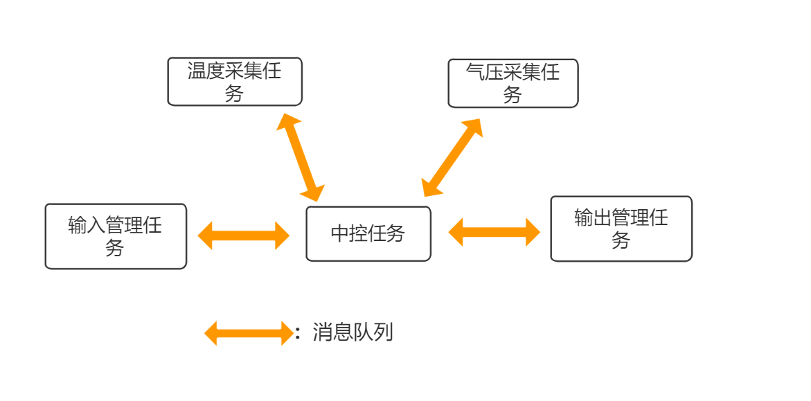

在嵌入式开发中合理的使用操作系统，可以更高效的开发应用，并十分有利于产品的迭代和维护。

<!--more-->

***

这里我们只讨论支持多任务的嵌入式实时操作系统（RTOS），如何理解多任务呢？以PC上的例子来说更容易理解。例如，你一边播放音乐，同时也在一边编辑文字。不管底层它们到底是真的并行，还是分时复用（并发），从体验上来看，这两个任务在你的PC上就像是在同时运行，这就是多任务的直观体现。

那么在嵌入式系统上，基于FreeRTOS这类嵌入式多任务操作系统进行应用开发有什么好处呢？ 毕竟，RTOS本身是需要占用存储和CPU资源的。
一个简单粗糙的解释，多任务操作系统，是将任务，通信机制等基础功能实现好了，开发者基于这一套框架，可以将更多的精力集中在业务功能上，加速产品的开发。

以一个环境采集监控系统为例，不使用RTOS的裸机程序，通常就是在Main 函数中实现一个无线循环，周期性的采集诸如温度、湿度、气压、等传传感器的数据，再通过LCD等显示设备将数据进行展示。功能代码全部集中在一起。对于早期开发维护人员来说或许这并没有什么障碍，但随着功能迭代，会逐渐出现各种新增需求。例如,增加一个用户输入功能（用来实时配置采集传感器的参数，或用来修改显示模式）。又例如，在检测到温度高于某个临界值后，闪烁红灯；在检测温度低于某个临界值后，闪烁绿灯。当这种需求越来越多，你的代码就会逐渐变得混乱不堪，让其它人难以理解，因为它们全都耦合在一起。

基于FreeRTOS这类多任务操作系统，我们可以将上述应用拆分成多个逻辑清晰的子任务。例如，一个温度采集任务，一个湿度采集任务，一个气压采集任务，一个中控任务，一个输入管理任务，一个输出管理任务等。这样每个任务的功能划分就很清晰。并且，各个任务间在代码实现上可以实现隔离，如果它们需要通信，可以通过RTOS提供的任务间通讯机制（例如**消息队列**）进行通讯，而不是直接调用其它任务中的功能函数，这样就实现了任务间的隔离和解耦。同时，后期维护，当需要修改某个功能的代码（例如修改温度采集相关功能的代码），可以不影响其它功能的逻辑（因为各个功能任务之间已经隔离）。而传统的裸机开发中，你修改的部分代码，可能所有功能逻辑都会涉及到这份代码（可能和其它功能无关，但是执行路径会经过它们），这种情况下，就容易造成对单个功能的改动影响到其它无关功能。

所谓“耦合”，个人理解是将业务“策略”和基础“机制”关联起来了（或是进行了某种“绑定”）。
例如上文说的，“当检测到温度高于某个临界值时，闪烁红灯”，这就是一种业务策略。 而其中“闪烁红灯”就是一种基础“机制”。  
如果将“当检测到温度高于某个临界值时，闪烁红灯” 看做一个整体来实现这个功能，所有类似“当XXX时，闪烁XXX”的需求，我们都要去实现一套类似的代码。 
而解耦，就是将策略和机制分离。例如：
- 温度采集和阈值判断放在一个任务中实现——业务相关策略任务
- 各种指示灯的控制放在另一个任务中来实现——基础机制任务

当业务策略任务，根据业务逻辑，判断要执行某一个动作时（以频率A闪烁某个指示灯），只需要通过RTOS提供的通信机制（如消息队列）向“指示灯控制任务"发送一个定义好的命令即可，指示灯控制任务根据收到的命令，控制相应的指示灯。
如此，对于“指示灯控制任务”来说，它不并不关心具体的业务逻辑，它只需要接收定义好的命令，并根据命令控制相应的指示灯即可。对于温度采集和阈值判断这个业务策略相关的任务，它只需要负责实现业务上定义好的各种判断逻辑，最终要执行的动作（温度过高/过低，闪烁红灯/绿灯），通过通信机制发送给“指示灯控制任务”即可。甚至， “温度采集和阈值判断”这个任务本身也可以拆分成两个更独立的任务，一个`温度采集任务`，一个`中控任务`。采集任务只管从硬件传感器中采集数据，并将数据发送给`中控任务`。而`中控任务`接收到数据后，执行相关业务逻辑判断（温度过高/过低？），最终再将要执行的动作发送给`指示灯控制任务`。 

例如，上文提到的环境采集监控系统，可以拆分成如下各个任务。
- **采集任务**只负责对相应传感器进行配置，以及对数据进行采集，并通过任务间通信机制(如**消息队列**)，将数据发送给中控任务。
  采集任务可以根据功能的复杂度来决定，是每个采集任务都用一个独立的任务，还是用单个任务来采集所有数据。
- **输入管理任务**只负责对输入设备进行配置，并获取用户输入，之后通过任务通信机制，将用户输入发送给中控任务。
- **输出管理任务**只负责对显示设备进行配置，它从**消息队列**中获取需要显示的数据，并进行展示（任务只负责显示，并不关心要显示的内容）。
- **中控任务**负责处理各种策略和逻辑。例如，它从**消息队列A**中提取数据（可能是采集任务发来的，也可能是输入管理任务发来的），并解析，如果需要做下一步动作（例如显示），则将相应的**命令**发送到**消息队列B**中，让下游任务（输出管理任务）执行具体的动作。

我们可以清晰地抽象出如下图所示的系统逻辑：

通过多任务和消息队列，我们将"**机制**"和"**策略**"进行了拆分。

像**采集任务/输入管理任务/输出管理任务**，这种类型的任务只提供基本的"功能机制"（采集传感器数据，获取用户输入数据，输出显示数据），它们并不关心数据本身是什么。
如采集任务，它们只负责收集数据，再将数据丢到相应**消息队列**中由下游任务来处理。
又如显示任务，它从相应**消息队列**中获取要显示数据，并进行显示。
如此，每个任务的代码就很清晰，职责也很明确，不会在这些模块中充斥着令人费解的业务相关"策略逻辑"（这些"策略逻辑"随着时间的推移，往往可能最后都没人清楚当初为什么要这样做，如果它们掺杂在基础功能代码中会非常影响代码阅读）。

另一方面，**中控任务**负责实现具体的业务相关的逻辑。它从**消息队列**中提取输入数据（可能是输入管理任务发来的数据，也可能是采集任务发来的数据），针对不同的数据（例如，通过消息的type字段来区分），进行一些业务逻辑上的处理，并可能进行一些数据展示（通过消息队列将要展示的数据发送给显示任务）。这样，我们就将业务相关的**策略逻辑**收敛到单个任务上进行集中处理，即使随着时间的推移我们丢失了某些**策略逻辑**的需求说明，但在中控任务中每个**策略逻辑**都有明确的输入和输出，所以在代码结构上还是比较清晰的。

所以，基于FreeRTOS这类多任务操作系统，我们可以将需要实现的应用功能拆分成多个更简单清晰的子任务，再通过RTOS提供的任务间通信机制，将各个子任务进行解耦，避免相互直接调用功能函数。这让我们可以更轻松的开发中/大型应用，也更利于产品的长期维护。

 
FreeRTOS交流QQ群-663806972
