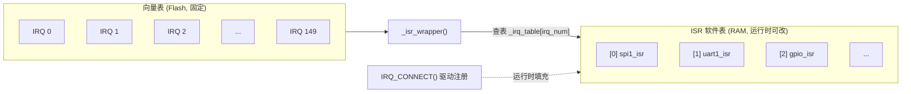
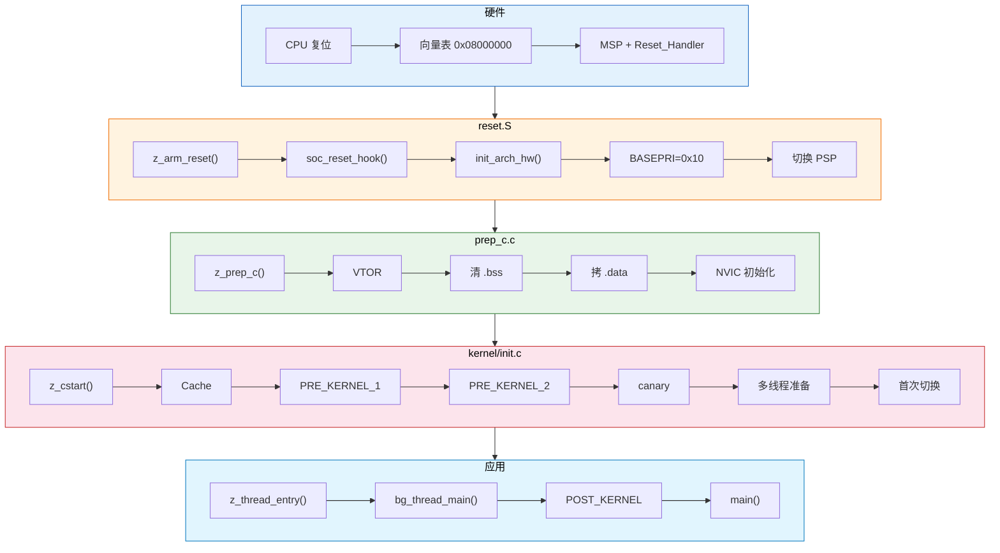

<center>
从按下复位键到 `main()` 函数被调用，Zephyr RTOS 经历了一段精密的初始化旅程。本文以 STM32H747I-DISCO 开发板为例，逐行解析从硬件复位向量到内核多线程切换的完整链路，涵盖 STM32H7 启动地址机制、向量表布局、`reset.S` 汇编初始化、`z_prep_c()` C 运行时准备、以及内核初始化等级的层层递进。
</center>
<!--more-->

***

> **硬件平台**: STM32H747I-DISCO | **Zephyr 版本**: v4.3.0-dev | **架构**: ARM Cortex-M7 (ARMv7-M)

## 1. 为什么要理解启动流程

理解 Zephyr 的启动流程，意味着你能回答这些问题：

- CPU 上电后第一条指令从哪里开始执行？`0x08000000` 这个地址是谁决定的？
- 为什么有些日志"看不到"——实际上是因为打印太早、串口驱动还没初始化
- 链接脚本里的 `FLASH` 和 `RAM` 区域地址是怎么来的？DTS 的 `chosen` 节点如何影响链接结果？
- `main()` 函数被调用之前，内核已经完成了哪些初始化？驱动的初始化顺序是谁定的？
- 第一次上下文切换发生在哪个节点？假线程（dummy thread）存在的意义是什么？

本文从硬件复位开始，逐阶段追踪 Zephyr 的启动序列。

---

## 2. 全局鸟瞰：从上电到 main 的完整路径

```
CPU 上电
  │
  ▼
┌─────────────────────────────────────────────────────────────┐
│ 1. 硬件复位                                                  │
│    从向量表读取 MSP（主栈指针）和 Reset_Handler 地址           │
│    向量表位置：0x08000000（STM32 Flash 起始地址）             │
└─────────────┬───────────────────────────────────────────────┘
              │
              ▼
┌─────────────────────────────────────────────────────────────┐
│ 2. z_arm_reset()            ← reset.S（纯汇编）              │
│    设置 MSP/PSP，禁用中断，初始化 FPU/MPU                     │
│    调用 soc_reset_hook()（SoC 专用初始化，如 TCM ECC 清零）   │
└─────────────┬───────────────────────────────────────────────┘
              │
              ▼
┌─────────────────────────────────────────────────────────────┐
│ 3. z_prep_c()             ← prep_c.c（C 语言开始）           │
│    清零 .bss，拷贝 .data，初始化中断控制器                    │
└─────────────┬───────────────────────────────────────────────┘
              │
              ▼
┌─────────────────────────────────────────────────────────────┐
│ 4. z_cstart()             ← kernel/init.c（内核核心初始化）   │
│    EARLY 等级 → arch_kernel_init → soc_early_init_hook       │
│    PRE_KERNEL_1/2 等级 → stack canary → 多线程切换            │
└─────────────┬───────────────────────────────────────────────┘
              │
              ▼
┌─────────────────────────────────────────────────────────────┐
│ 5. prepare_multithreading()                                  │
│    初始化调度器，创建 main 线程 + idle 线程                   │
└─────────────┬───────────────────────────────────────────────┘
              │
              ▼
┌─────────────────────────────────────────────────────────────┐
│ 6. switch_to_main_thread()                                   │
│    首次上下文切换，跳转到 bg_thread_main()                    │
└─────────────┬───────────────────────────────────────────────┘
              │
              ▼
┌─────────────────────────────────────────────────────────────┐
│ 7. bg_thread_main()                                         │
│    执行 POST_KERNEL / APPLICATION 初始化等级                 │
│    调用 main()                                               │
└─────────────────────────────────────────────────────────────┘
```

---

## 3. 第一步：硬件复位 — STM32H7 如何找到第一行代码

### 3.1 启动地址机制：Option Bytes 与 BOOT 引脚

STM32H747 是双核芯片（Cortex-M7 + Cortex-M4），启动行为由 **Option Bytes**（选项字节）控制，而非单一的 BOOT 引脚。

**Option Byte 不是普通寄存器**：存在于 Flash 的特殊区域，掉电保持，硬件上电时自动读取（此时软件尚未运行）。可通过 STM32CubeProgrammer 修改。

**三个关键配置**：

① **BCM7 / BCM4** — 控制哪个核启动

| BCM7 | BCM4 | 行为 |
|------|------|------|
| **1** | **1** | **出厂默认：两个核都启动** |
| 1 | 0 | 只有 M7 启动（M4 可被 M7 软件唤醒） |
| 0 | 1 | 只有 M4 启动 |
| 0 | 0 | 两个核都不自动启动 |

② **BCM7_ADD0 / ADD1** — M7 的启动地址

| Option Byte | 出厂默认值 | 含义 |
|-------------|-----------|------|
| BCM7_ADD0 | **0x08000000** | Flash（BOOT=0 时使用） |
| BCM7_ADD1 | 0x00000000 | ITCM-RAM（BOOT=1 时使用） |

③ **BOOT 引脚** — 芯片上的物理引脚，选择用 ADD0 还是 ADD1

```
BOOT = 0（当前开发板设置，BOOT 脚接地）→ 使用 ADD0 = 0x08000000（从 Flash 启动）
BOOT = 1                              → 使用 ADD1 = 0x00000000（从 ITCM-RAM 启动）
```

**完整启动决策流程**：

```
上电
  │
  ├─ ① 硬件读取 Option Byte: BCM7=1, BCM4=1 → M7 启动（M4 也启动但无固件）
  ├─ ② 硬件采样 BOOT 引脚 → BOOT=0 → 使用 BCM7_ADD0
  ├─ ③ 硬件读取 BCM7_ADD0 = 0x08000000
  ├─ ④ 硬件将 CPU 取指地址指向 0x08000000
  └─ ⑤ 从 0x08000000 读 MSP，从 0x08000004 读 Reset_Handler → CPU 开始执行
```

### 3.2 上电时 VTOR 的状态

ARM Cortex-M 架构规定：**复位后 VTOR = 0**，CPU 理论上从 `0x00000000` 读取向量表。

STM32H7 的实现：不是简单地把 `0x08000000` 别名映射到 `0x00000000`，而是通过 **BOOT 引脚 + Option Bytes 机制**，硬件直接把 CPU 的初始取指地址指向 `BCM7_ADD0` 指定的地址（默认 `0x08000000`）。

```
上电时：硬件直接从 0x08000000 取 MSP 和 Reset_Handler（不经过 VTOR）
         │
         ▼ z_prep_c() 中显式设置
运行时：SCB->VTOR = 0x08000000  ← 锁定向量表位置，确保后续中断可靠
```

### 3.3 向量表：Flash 开头的一张函数指针数组

向量表是 Flash 开头的一张**函数指针数组**，CPU 上电后第一条指令就从这里找：

```
Flash: 0x0800_0000
  ┌──────────────┐
  │ 0x0800_0000  │ → MSP 初始值（主栈指针，指向栈顶）
  ├──────────────┤
  │ 0x0800_0004  │ → Reset_Handler（复位入口 = z_arm_reset）
  ├──────────────┤
  │ 0x0800_0008  │ → NMI_Handler
  ├──────────────┤
  │ 0x0800_000C  │ → HardFault_Handler
  ├──────────────┤
  │ ...          │ → 其他异常和中断
  └──────────────┘
```

**关键理解**：
- CPU 硬件自动从 `0x0800_0000` 加载 MSP，从 `0x0800_0004` 加载 PC
- STM32H7 通过 `SCB->VTOR` 寄存器可以在运行时重定位向量表

### 3.4 向量表地址 0x08000000 的完整传递链

0x08000000 从 DTS 到运行时的 5 层传递：

```
① 设备树 DTS:
   stm32h747Xi_m7.dtsi:
     flash0: flash@8000000 { reg = <0x08000000 DT_SIZE_K(1024)>; }
   stm32h747i_disco_m7.dts:
     chosen { zephyr,flash = &flash0; }

② CMake 阶段（dts.cmake）:
   运行 gen_edt.py 解析所有 DTS 文件
   → 生成 edt.pickle（序列化的 Python EDT 对象）

③ Kconfig 函数（kconfigfunctions.py）:
   调用 dt_chosen_reg_addr_hex("zephyr,flash"):
     ① edt.chosen_node("zephyr,flash") → 找到 flash0 节点
     ② flash0.regs[0].addr → 提取 0x08000000
     ③ hex(0x08000000) → 返回 "0x8000000"

④ Kconfig 定义（arch/Kconfig）:
   config FLASH_BASE_ADDRESS
       default $(dt_chosen_reg_addr_hex,zephyr,flash)
       → CONFIG_FLASH_BASE_ADDRESS = 0x8000000

⑤ 链接脚本（linker.cmd）:
   __rom_region_start = 0x08000000
   _vector_start = .（在 FLASH 最开头）
   → prep_c.c 中: SCB->VTOR = _vector_start
```

**关键机制**：CMake 把 DTS 解析成 Python 对象（edt.pickle），Kconfig 求值时通过 Python 函数 `dt_chosen_reg_addr_hex()` 从中查找 `zephyr,flash` 指向的节点的 `reg` 属性，提取出 `0x08000000`。

### 3.5 链接脚本中向量表段的详细分析

**源码位置**：`build/zephyr/linker.cmd`

```ld
__rom_region_start = (0x8000000 + 0x0);
rom_start :
{
    . = ALIGN(4);
    . = ALIGN( 1 << LOG2CEIL(4 * 32) );         ← VTOR 对齐：128 字节
    . = ALIGN( 1 << LOG2CEIL(4 * (16 + 150)) );   ← 向量表大小对齐：1024 字节
    _vector_start = .;
    KEEP(*(.exc_vector_table))          ← 系统异常向量（编译时固定）
    KEEP(*(".exc_vector_table.*"))
    KEEP(*(.vectors))
    _vector_end = .;
    KEEP(*(.gnu.linkonce.irq_vector_table*))  ← IRQ 向量（指向 _isr_wrapper）
    _vector_end = .;
} > FLASH
```

**ALIGN 为什么不移动位置？**

`0x08000000` = 二进制末尾有 27 个零，天然满足所有对齐要求：

```
. = ALIGN(4)    → 需要 2 位对齐   ✓ 不动
. = ALIGN(128)  → 需要 7 位对齐   ✓ 不动
. = ALIGN(1024) → 需要 10 位对齐  ✓ 不动
→ _vector_start = 0x08000000（精确在 Flash 起始位置）
```

ALIGN 是**安全网**——如果起始地址不是 `0x08000000`（比如从 SRAM 启动），对齐操作会自动调整。

### 3.6 向量表的实际内容

**源码位置**：`zephyr/arch/arm/core/cortex_m/vector_table.S`

STM32H7 M7 核是 ARMv7-M Mainline 架构，16 个系统异常**全都有**：

```
偏移    内容
[0] +0x00  z_main_stack + CONFIG_MAIN_STACK_SIZE  ← MSP 初始值
[1] +0x04  z_arm_reset                            ← Reset Handler
[2] +0x08  z_arm_nmi                              ← NMI
[3] +0x0C  z_arm_hard_fault                       ← HardFault
[4] +0x10  z_arm_mpu_fault                        ← MemManage
[5] +0x14  z_arm_bus_fault                        ← BusFault
[6] +0x18  z_arm_usage_fault                      ← UsageFault
[7] +0x1C  0（SecureFault，需 TrustZone）
[8]-[10]   0（保留）
[11]+0x2C  z_arm_svc                              ← SVCall
[12]+0x30  z_arm_debug_monitor                    ← Debug Monitor
[13]+0x34  0（保留）
[14]+0x38  z_arm_pendsv                           ← PendSV（上下文切换）
[15]+0x3C  sys_clock_isr                          ← SysTick（系统时钟）
[16]+0x40  外设 IRQ 0 ...                         ← 150 个外设中断
```

### 3.7 静态向量表 vs 动态 ISR 表

链接脚本中有两种向量段，对应不同的中断处理方式：

| 段名 | 内容 | 可变性 |
|------|------|--------|
| `.exc_vector_table` | 系统异常（Reset, NMI, Fault...） | 编译时固定 |
| `.gnu.linkonce.irq_vector_table` | 外设中断（IRQ 0~149） | 全部指向 `_isr_wrapper` |

**动态分发机制**：



**动态分发的意义**：驱动在运行时用 `IRQ_CONNECT()` 注册 ISR，而不是编译时写死。这样同一中断号可以接不同驱动，支持动态加载。

### 3.8 向量表的两级源码实现

`vector_table.S` 中只有 16 个系统异常，外设中断（IRQ 0~149）的定义在 `zephyr/arch/common/isr_tables.c` 中：

```c
// zephyr/arch/common/isr_tables.c:59-83
#ifdef CONFIG_GEN_SW_ISR_TABLE
#define IRQ_VECTOR_TABLE_DEFAULT_ISR    _isr_wrapper    // 有软件 ISR 表 → 统一指向 _isr_wrapper
#else
#define IRQ_VECTOR_TABLE_DEFAULT_ISR    z_irq_spurious  // 无软件 ISR 表 → 指向空处理
#endif

// 外设中断向量表：所有 IRQ 统一填充为同一个入口
const uintptr_t __irq_vector_table _irq_vector_table[IRQ_TABLE_SIZE] = {
    [0 ...(IRQ_TABLE_SIZE - 1)] = (uintptr_t)&IRQ_VECTOR_TABLE_DEFAULT_ISR,
};
```

**两级向量表的源码分工**：

| 源文件 | 段名 | 内容 | 原因 |
|--------|------|------|------|
| `vector_table.S` | `.exc_vector_table` | 16 个系统异常 | 每个异常有独立处理函数（hard_fault、svc、pendsv 等），必须逐个定义 |
| `isr_tables.c` | `.gnu.linkonce.irq_vector_table` | 全部 IRQ → `_isr_wrapper` | 本质是同值数组，用 C 的 range initializer `[0 ...(N-1)]` 一行填充 |

链接脚本将两个段拼在一起，形成完整的向量表：

```ld
KEEP(*(.exc_vector_table))                         ← 系统异常（vector_table.S）
KEEP(*(.vectors))
KEEP(*(.gnu.linkonce.irq_vector_table*))            ← 外设中断（isr_tables.c）
```

最终 ELF 中是一段连续的函数指针数组：16 个系统异常入口 + 150 个 `_isr_wrapper`。

---

## 4. 第二步：z_arm_reset() — 汇编级逐行深度解析

**源码位置**：`zephyr/arch/arm/core/cortex_m/reset.S`

这是 CPU 执行的**第一段用户代码**（纯汇编）。以下按 STM32H7（ARMv7-M Mainline）实际执行的路径，逐行详解每条汇编和涉及的系统寄存器。

### 4.1 完整执行时间线（STM32H7 实际路径）

在逐行分析前，先看 `z_arm_reset()` 的完整执行流程：

```
z_arm_reset:
  │
  ├─ movs r0, #0; msr CONTROL, r0; isb      ← 重置 CONTROL
  │   此时：CONTROL=0, 使用MSP, 特权模式
  │
  ├─ ldr r0, =z_main_stack+size; msr msp, r0 ← 设置 MSP
  │   此时：MSP = 主栈顶部
  │
  ├─ bl soc_reset_hook                       ← 清零 TCM（防 ECC）
  │
  ├─ movs r0, #0; str r0, [MPU_CTRL]; dsb    ← 禁用 MPU
  │
  ├─ bl z_arm_init_arch_hw_at_boot           ← 初始化 NVIC、Cache
  │
  ├─ movs r0, #prio; msr BASEPRI, r0         ← 屏蔽普通中断
  │   此时：中断全禁，只有 NMI/Fault 能触发
  │
  ├─ ldr r0, =z_interrupt_stacks+size        ← 设置 PSP
  │  msr PSP, r0
  ├─ mrs r0, CONTROL; orrs r0, #2; msr CONTROL, r0; isb
  │   此时：CONTROL.SPSEL=1, CPU 使用 PSP
  │
  └─ bl z_prep_c                             ← 跳转至 C 运行时准备
```

### 4.2 涉及的 ARM Cortex-M 系统寄存器速查

| 寄存器 | 访问方式 | 位域 | 作用 |
|--------|----------|------|------|
| **CONTROL** | 特殊寄存器（MRS/MSR） | bit[2] FPCA: FP 上下文活跃<br>bit[1] SPSEL: 0=MSP, 1=PSP<br>bit[0] nPRIV: 0=特权, 1=非特权 | 控制栈选择和特权级别 |
| **MSP** | 特殊寄存器（MRS/MSR） | 32bit | 主栈指针（复位后默认使用） |
| **PSP** | 特殊寄存器（MRS/MSR） | 32bit | 进程栈指针（线程使用） |
| **BASEPRI** | 特殊寄存器（MRS/MSR） | bit[7:0] | 优先级屏蔽阈值（≥此值的中断被屏蔽） |
| **FAULTMASK** | 特殊寄存器（MRS/MSR） | bit[0] | 异常屏蔽（=1 时屏蔽所有可编程异常） |
| **MPU_CTRL** | 0xE000ED94（存储器映射） | bit[0] ENABLE, bit[1] HFNMIENA, bit[2] PRIVDEFENA | MPU 总开关 |

### 4.3 逐行详解

#### 阶段 1：重置 CONTROL 寄存器

```asm
/* 第 93-97 行：重置 CONTROL 为默认值 */
movs.n r0, #0            /* r0 = 0 */
msr CONTROL, r0          /* CONTROL = 0 → 使用 MSP，特权模式 */
isb                       /* 指令同步屏障：确保 CONTROL 写入生效 */
```

**CONTROL 寄存器详解**（ARMv7-M，Cortex-M7 有效位域）：
```
CONTROL 寄存器（特殊寄存器，通过 MRS/MSR 访问）:
  bit[0] nPRIV  = 0  → 特权模式（可访问所有资源）
  bit[1] SPSEL  = 0  → 使用 MSP（主栈指针）
  bit[2] FPCA   = 0  → 无活跃的浮点上下文
```

**重置的原因**：这段代码可能被 bootloader 链式加载（chain-loading），此时 CONTROL 可能不是默认值。重置确保从已知状态开始。

**`isb` 是什么？** Instruction Synchronization Barrier（指令同步屏障）。写 CONTROL 后必须跟 `isb`，否则 CPU 流水线可能还在用旧的栈指针。ARM 架构要求：**修改 CONTROL 或栈指针后，必须用 `isb` 确保生效**。

#### 阶段 2：清零栈限制寄存器

```asm
/* 第 98-103 行：清零 SPLIM（如果 CPU 支持） */
movs.n r0, #0            /* r0 = 0 */
msr MSPLIM, r0           /* MSP 栈下限 = 0（不限制） */
msr PSPLIM, r0           /* PSP 栈下限 = 0（不限制） */
```

**MSPLIM / PSPLIM 是什么？** ARMv8-M 引入的栈溢出检测寄存器。如果 MSP < MSPLIM，触发 Stack Overflow 异常。启动阶段清零 = 暂不检测。

STM32H7 的 Cortex-M7 是 ARMv7-M 架构，**没有 SPLIM 寄存器**，所以这段代码实际**不编译**（被 `#if defined(CONFIG_CPU_CORTEX_M_HAS_SPLIM)` 排除）。ARMv8-M 架构的处理器（如 Cortex-M33/M55）才有此寄存器。

#### 阶段 3：设置 MSP 到主栈

```asm
/* 第 147-148 行：设置 MSP */
ldr r0, =z_main_stack + CONFIG_MAIN_STACK_SIZE    /* r0 = 主栈顶部地址 */
msr msp, r0              /* MSP = 主栈顶部 */
```

**`ldr r0, =xxx`** 是伪指令，把 32 位常量加载到 r0。`z_main_stack` 是链接脚本中定义的符号，`CONFIG_MAIN_STACK_SIZE` 通常为 1024 或 2048。

**使用 MSP 的原因**：此时 CONTROL.SPSEL=0，CPU 还在使用 MSP。后续代码需要 MSP 来执行 `soc_reset_hook()` 等函数调用（函数调用需要栈来保存返回地址）。

#### 阶段 4：调用 SoC 复位钩子

```asm
/* 第 162-164 行：调用 STM32H7 专用复位函数 */
bl soc_reset_hook         /* 跳转并保存返回地址到 LR */
```

**`bl` = Branch with Link**：跳转到 `soc_reset_hook`，同时把下一条指令的地址保存到 `LR`（R14），函数返回时 `bx lr` 跳回来。

**soc_reset_hook() 做了什么？** 以 STM32H7 为例，清零 TCM 内存（防 ECC 错误）：

```c
// zephyr/soc/st/stm32/stm32h7x/soc_m7.c
// 地址和大小从 Device Tree chosen 节点获取，非硬编码
#define ITCM_BASE  DT_REG_ADDR(DT_CHOSEN(zephyr_itcm))   // → 0x00000000
#define ITCM_END   (ITCM_BASE + DT_REG_SIZE(DT_CHOSEN(zephyr_itcm)))  // → 0x00010000 (64KB)
#define DTCM_BASE  DT_REG_ADDR(DT_CHOSEN(zephyr_dtcm))   // → 0x20000000
#define DTCM_END   (DTCM_BASE + DT_REG_SIZE(DT_CHOSEN(zephyr_dtcm)))  // → 0x20020000 (128KB)

void soc_reset_hook(void)
{
    // 清零 ITCM — volatile 64位对齐写入（防止编译器优化掉清零操作）
#ifdef ITCM_BASE
    BUILD_ASSERT(ITCM_BASE % sizeof(uint64_t) == 0, "ITCM must be 64-bit aligned");
    for (volatile uint64_t *p = (volatile uint64_t *)ITCM_BASE;
         p < (volatile uint64_t *)ITCM_END; p++) { *p = 0; }
#endif

    // 清零 DTCM — volatile 32位对齐写入
#ifdef DTCM_BASE
    BUILD_ASSERT(DTCM_BASE % sizeof(uint32_t) == 0, "DTCM must be 32-bit aligned");
    for (volatile uint32_t *p = (volatile uint32_t *)DTCM_BASE;
         p < (volatile uint32_t *)DTCM_END; p++) { *p = 0; }
#endif
}
```

**关键设计**：地址和大小从 Device Tree 的 `zephyr_itcm` / `zephyr_dtcm` chosen 节点获取，同一 SoC 的不同变体（ITCM 大小不同）无需改代码。`BUILD_ASSERT` 在编译时验证对齐要求。`volatile` 防止编译器将清零循环优化掉。

STM32H7 需要清零 TCM 是因为其上电后内容未定义，访问会触发 ECC 错误 → HardFault（参考 ST AN5342 Rev.7 §3.1.1）。其他 SoC 可能在此执行 PLL 预配置、看门狗关闭等操作。

#### 阶段 5：禁用 MPU

```asm
/* 第 167-173 行：关闭 MPU */
movs.n r0, #0                         /* r0 = 0 */
ldr r1, =_SCS_MPU_CTRL                /* r1 = 0xE000ED94 (MPU_CTRL 地址) */
str r0, [r1]                          /* MPU_CTRL = 0 → 禁用 MPU */
dsb                                    /* 数据同步屏障 */
```

**MPU_CTRL 寄存器详解**：
```
MPU_CTRL (0xE000ED94):
  bit[0] ENABLE      = 0  → MPU 禁用
  bit[1] HFNMIENA    = 0  → HardFault/NMI 时禁用 MPU
  bit[2] PRIVDEFENA  = 0  → 特权模式默认映射禁用
```

**先禁用 MPU 的原因**：后续要设置栈指针、拷贝数据，如果 MPU 配置了内存保护，可能会阻止这些操作。先禁用，等内核初始化完成后再配置并启用。

**`dsb` 是什么？** Data Synchronization Barrier（数据同步屏障）。确保 MPU_CTRL 写入到达硬件后再继续。

#### 阶段 6：初始化架构硬件

```asm
/* 第 176 行 */
bl z_arm_init_arch_hw_at_boot    /* 初始化 NVIC、MPU、Cache */
```

**源码位置**：`zephyr/arch/arm/core/cortex_m/scb.c`（93-155 行）

这个函数把 CPU 内部所有硬件状态重置到已知值，防止前一个固件（bootloader）留下残余配置：

```c
void z_arm_init_arch_hw_at_boot(void)
{
    __disable_irq();                    // 1. 禁用全局中断
    __set_FAULTMASK(0);                 // 2. 清除 Fault 屏蔽

    z_arm_clear_arm_mpu_config();       // 3. 清除所有 MPU 区域配置

    // 4. 禁用所有 NVIC 中断
    for (i = 0; i < ARRAY_SIZE(NVIC->ICER); i++)
        NVIC->ICER[i] = 0xFFFFFFFF;    // ICER: Interrupt Clear Enable Register

    // 5. 清除所有 NVIC 挂起中断
    for (i = 0; i < ARRAY_SIZE(NVIC->ICPR); i++)
        NVIC->ICPR[i] = 0xFFFFFFFF;    // ICPR: Interrupt Clear Pending Register

    // 6. 处理 Cache 状态
    if (SCB->CCR & SCB_CCR_DC_Msk)
        SCB_DisableDCache();            // D-Cache 已启用 → 先清空再禁用
    else
        SCB_InvalidateDCache();         // D-Cache 未启用 → 直接无效化
    SCB_DisableICache();                // 禁用 I-Cache

    __enable_irq();                     // 7. 恢复中断
    barrier_dsync_fence_full();         // 8. 数据屏障
    barrier_isync_fence_full();         // 9. 指令屏障
}
```

**涉及的寄存器详解**：

| 步骤 | 寄存器 | 访问方式 | 操作 | 目的 |
|------|--------|----------|------|------|
| 2 | FAULTMASK | 特殊寄存器（MRS/MSR） | 写 0 | 允许所有 Fault 触发 |
| 3 | MPU_RNR/RBAR/RASR | 0xE000ED98..（存储器映射） | 清除所有区域 | MPU 回到空白状态 |
| 4 | NVIC->ICER[n] | 0xE000E180..（存储器映射） | 写全 1 | 禁用所有外设中断 |
| 5 | NVIC->ICPR[n] | 0xE000E280..（存储器映射） | 写全 1 | 清除所有挂起中断 |
| 6 | SCB->CCR | 0xE000ED14（存储器映射） | 检查 DC 位 | 根据当前状态决定如何处理 Cache |

**NVIC 寄存器特性**：`ICER`（Interrupt Clear Enable）写 1 禁用对应中断，`ICPR`（Interrupt Clear Pending）写 1 清除挂起状态。这是 ARM 的"写 1 清除/设置"模式——读和写的含义不同。

#### 阶段 7：禁用普通中断（保留 Fault）

```asm
/* 第 182-184 行（ARMv7-M 路径） */
movs.n r0, #_EXC_IRQ_DEFAULT_PRIO    /* r0 = 优先级阈值 */
msr BASEPRI, r0                       /* BASEPRI = 阈值 → 屏蔽普通中断 */
```

**ARM Cortex-M 三级优先级体系**：

| 层级 | 优先级 | 异常 | BASEPRI 能屏蔽？ |
|------|--------|------|-----------------|
| 固定（不可屏蔽） | -3 | Reset | 永远不能 |
| 固定（不可屏蔽） | -2 | NMI（不可屏蔽中断） | 永远不能 |
| 固定（不可屏蔽） | -1 | HardFault | 永远不能 |
| 可编程 Fault | 0x00（默认） | MemManage / BusFault / UsageFault | 不屏蔽（< 0x10） |
| 可编程系统 | 0x00（默认） | SVCall | 不屏蔽（< 0x10） |
| 普通外设 | 0x10~0xF0 | UART, SPI, DMA, TIM... | **全部屏蔽** |
| 系统 | 0xFF | PendSV, SysTick | **全部屏蔽** |

**BASEPRI 寄存器详解**（特殊寄存器，通过 MRS/MSR 访问）：

```
规则：屏蔽所有优先级 ≥ 写入值的中断
写入 0x10 → 屏蔽 ≥ 0x10 的中断，保留 < 0x10 的
写入 0x00 → 不屏蔽任何中断（全部允许）
```

**`_EXC_IRQ_DEFAULT_PRIO` 的推导**：

```c
// DTS 定义: stm32h7.dtsi → NUM_IRQ_PRIO_BITS = 4（STM32H7 用 4 位优先级）

// exception.h 计算链:
_EXCEPTION_RESERVED_PRIO  = 1     // ARMv7-M 为 Fault 保留 1 级
_EXC_SVC_PRIO             = 0     // 未启用 ZERO_LATENCY_IRQS
_IRQ_PRIO_OFFSET          = 1 + 0 = 1

Z_EXC_PRIO(pri) = (pri << (8 - NUM_IRQ_PRIO_BITS)) & 0xFF
                = (pri << 4) & 0xFF    // 左移 4 位，填到高半字节

_EXC_IRQ_DEFAULT_PRIO = Z_EXC_PRIO(1) = (1 << 4) = 0x10
```

**优先级寄存器的位布局**：STM32H7 只有 4 位有效优先级，放在 8 位寄存器的高 4 位：

```
硬件 8 位优先级寄存器:
  bit[7:4] = 有效位    bit[3:0] = 始终为 0

  逻辑优先级 0  → 0b0001_0000 = 0x10  ← Fault 用
  逻辑优先级 1  → 0b0001_0000 = 0x10  ← _EXC_IRQ_DEFAULT_PRIO
  逻辑优先级 2  → 0b0010_0000 = 0x20
  ...
  逻辑优先级 15 → 0b1111_0000 = 0xF0  ← 最低
```

**BASEPRI=0x10 后的效果**：

```
能触发: Reset, NMI, HardFault（固定优先级，BASEPRI 管不了）
能触发: MemManage, BusFault, UsageFault, SVC（优先级 0x00 < 0x10）
被屏蔽: 所有外设中断（UART, SPI, TIM...）、PendSV、SysTick（≥ 0x10）

设计原因: 启动阶段中断全关，但 Fault 必须能触发
         如果启动代码有 bug（如非法地址访问），Fault 能捕获
         否则系统会无声死锁
```

#### 阶段 8：切换到 PSP（进程栈指针）

```asm
/* 第 213-226 行 */
ldr r0, =z_interrupt_stacks                         /* r0 = 中断栈起始 */
ldr r1, =CONFIG_ISR_STACK_SIZE + MPU_GUARD_ALIGN_AND_SIZE  /* r1 = 栈大小 */
adds r0, r0, r1                                      /* r0 = 中断栈顶部 */
msr PSP, r0                                          /* PSP = 中断栈顶部 */
```

```asm
mrs r0, CONTROL                    /* 读取 CONTROL 当前值 */
movs r1, #(2 | CONTROL_ARM_PAC_MASK | CONTROL_ARM_BTI_MASK)
                                   /* Cortex-M7: PAC/BTI 未启用，两个 MASK = 0 */
                                   /* 实际等价于 movs r1, #2（只设 SPSEL 位） */
orrs r0, r1                        /* r0 |= 0x02 → 设置 SPSEL 位 */
msr CONTROL, r0                    /* CONTROL.SPSEL = 1 → 切换到 PSP */
isb                                 /* 同步屏障：确保栈切换生效 */
```

**CONTROL.SPSEL 的含义**：

```
CONTROL 寄存器:
  bit[1] SPSEL = 0  → CPU 使用 MSP（复位默认）
  bit[1] SPSEL = 1  → CPU 使用 PSP（线程模式）

这一步之后：
  MSP → 空出来，后续设为中断栈
  PSP → 当前代码使用，指向 interrupt_stack 顶部
```

**`mrs` / `msr` 而非 `movs` 的原因**：CONTROL 是特殊寄存器，必须通过 `mrs`（读）和 `msr`（写）访问，不能用普通 mov 指令。

#### 阶段 9：跳转到 C 语言

```asm
/* 第 233 行 */
bl z_prep_c             /* 跳转到 C 运行时准备函数 */
```

**`bl`** = Branch with Link，跳转并把返回地址存入 LR。但 `z_prep_c()` 声明为 `FUNC_NORETURN`，永远不会返回。

### 4.4 三个屏障指令的区别

| 指令 | 全称 | 作用 | 何时使用 |
|------|------|------|----------|
| `isb` | Instruction Synchronization Barrier | 刷新流水线，确保后续指令看到之前的系统寄存器修改 | 修改 CONTROL、栈指针后 |
| `dsb` | Data Synchronization Barrier | 等待所有显式内存访问完成 | 修改 MPU 配置后 |
| `dmb` | Data Memory Barrier | 确保内存操作顺序 | 多核共享内存时 |

**区分要点**：`isb` 作用于 CPU 流水线，`dsb` 等待内存总线写入完成，`dmb` 保证内存操作顺序。

---

## 5. 第三步：z_prep_c() — C 运行时环境准备

**源码位置**：`zephyr/arch/arm/core/cortex_m/prep_c.c`

进入 C 语言世界前，需要建立 C 程序的基本假设：`.bss` 清零、`.data` 拷贝、中断控制器就绪。

```
z_prep_c()
  │
  ├─ 1. soc_prep_hook()            ← SoC 级预备（可选）
  ├─ 2. relocate_vector_table()    ← 设置 SCB->VTOR
  ├─ 3. z_arm_floating_point_init() ← FPU 初始化
  ├─ 4. arch_bss_zero()            ← 清零 .bss 段
  ├─ 5. arch_data_copy()           ← 拷贝 .data 段（Flash → RAM）
  ├─ 6. z_arm_interrupt_init()      ← NVIC 优先级初始化
  ├─ 7. arch_cache_init()          ← Cache 初始化（Cortex-M 为空函数）
  ├─ 8. [可选] 空指针检测           ← DWT 空指针异常检测（默认关闭）
  └─ 9. z_cstart()                 ← 进入内核核心初始化
```

### 5.1 relocate_vector_table() — 向量表重定位

```c
void __weak relocate_vector_table(void)
{
#ifdef CONFIG_SRAM_VECTOR_TABLE
    // 如果配置了 SRAM 向量表：拷贝向量表到 RAM（更快响应中断）
    size_t vector_size = (size_t)_vector_end - (size_t)_vector_start;
    arch_early_memcpy(_sram_vector_start, _vector_start, vector_size);
#endif
    // 核心操作：设置 VTOR 指向向量表地址
    SCB->VTOR = VECTOR_ADDRESS & VTOR_MASK;  // = 0x08000000
    barrier_dsync_fence_full();   // 确保写入到达硬件
    barrier_isync_fence_full();   // 刷新流水线
}
```

**`__weak` 的含义**：弱符号——SoC 可以提供一个强符号版本来覆盖此函数。

**VTOR 寄存器**（`0xE000ED08`）：
```
bit[31:7]  = 向量表基地址（0x08000000 对齐到 128 字节）
bit[6:0]   = 保留（必须为 0）
VTOR_MASK  = SCB_VTOR_TBLOFF_Msk  ← 屏蔽掉低 7 位
```

### 5.2 z_arm_floating_point_init() — FPU 初始化

STM32H7 有**双精度浮点单元**（FPU），需要配置 CPACR 和 FPCCR 两个寄存器：

```c
static inline void z_arm_floating_point_init(void)
{
    // 1. 先禁用 FPU 访问（清除之前的配置）
    SCB->CPACR &= (~(CPACR_CP10_Msk | CPACR_CP11_Msk));

#if defined(CONFIG_FPU)  // 项目中启用了 FPU
    // 2. 启用 CP10/CP11 协处理器（FPU 寄存器访问）
    SCB->CPACR |= CPACR_CP10_PRIV_ACCESS | CPACR_CP11_PRIV_ACCESS;

    // 3. 配置浮点上下文保存策略
    FPU->FPCCR = FPU_FPCCR_ASPEN_Msk | FPU_FPCCR_LSPEN_Msk;
    //  ASPEN = 自动保存：使用 FP 指令时自动设 FPCA 位
    //  LSPEN = 延迟保存：中断进入时不立即保存 FP 寄存器，用到时才保存
    //  → 减少中断延迟，节省栈空间

    __set_FPSCR(0);
#endif
}
```

**延迟保存（Lazy Stacking）的意义**：

Cortex-M7 FPU 有 S0-S31 共 32 个单精度寄存器和 1 个 FPSCR。但硬件异常入口只保存其中一半：

```
硬件自动保存: S0-S15 + FPSCR + reserved = 18 words (72 字节)
软件保存:     S16-S31（callee-saved，仅上下文切换时由软件保存）

无延迟保存: 中断进入时硬件立即写入 S0-S15 + FPSCR = 72 字节，需要数十个时钟周期
有延迟保存: 中断进入时硬件只预留空间，不实际写入
            → 如果 ISR 不用 FP，完全省去保存开销
            → 如果 ISR 用 FP，在第一次 FP 指令时才触发实际保存
```

### 5.3 arch_bss_zero() — .bss 段清零

**源码位置**：`zephyr/arch/common/init.c`（50-81 行）

```c
__boot_func void arch_bss_zero(void)
{
    // 主 .bss 段清零（AXI SRAM 中）
    arch_early_memset(__bss_start, 0, __bss_end - __bss_start);

    // DTCM .bss 段清零（如果有）
#if DT_NODE_HAS_STATUS_OKAY(DT_CHOSEN(zephyr_dtcm))
    arch_early_memset(&__dtcm_bss_start, 0,
        (uintptr_t)&__dtcm_bss_end - (uintptr_t)&__dtcm_bss_start);
#endif
}
```

`__bss_start` 和 `__bss_end` 是链接脚本提供的符号，标记 `.bss` 段的起止地址。

### 5.4 arch_data_copy() — .data 段拷贝

```c
void arch_data_copy(void)
{
    // 主 .data 段：从 Flash 拷贝到 RAM
    arch_early_memcpy(&__data_region_start, &__data_region_load_start,
        __data_region_end - __data_region_start);

    // DTCM 数据段（如果有）
#if DT_NODE_HAS_STATUS_OKAY(DT_CHOSEN(zephyr_dtcm))
    arch_early_memcpy(&__dtcm_data_start, &__dtcm_data_load_start,
        __dtcm_data_end - __dtcm_data_start);
#endif
}
```

**涉及的符号**（全部由链接脚本定义）：

| 符号 | 含义 |
|------|------|
| `__data_region_start` | RAM 中 .data 段的起始地址（目标） |
| `__data_region_load_start` | Flash 中 .data 段初始值的起始地址（源） |
| `__data_region_end` | RAM 中 .data 段的结束地址 |

```
Flash                        RAM
┌─────────────────┐          ┌─────────────────┐
│ __data_load_start│ ──copy→ │ __data_start     │
│   (.data 初始值) │          │   (.data 运行时) │
│                 │          │ __data_end       │
└─────────────────┘          └─────────────────┘
```

### 5.5 z_arm_interrupt_init() — NVIC 优先级初始化

```c
void z_arm_interrupt_init(void)
{
    int irq = 0;
    // 遍历所有 IRQ，设置默认优先级
    for (; irq < CONFIG_NUM_IRQS; irq++) {
        NVIC_SetPriority((IRQn_Type)irq, _IRQ_PRIO_OFFSET);
        // _IRQ_PRIO_OFFSET = 1（逻辑优先级）
        // 经 Z_EXC_PRIO 转换后 = 0x10（硬件值）
    }
}
```

**效果**：所有 150 个外设中断的默认优先级设为 `0x10`（第二高优先级）。驱动初始化时可通过 `IRQ_CONNECT()` 覆盖。

---

## 6. 第四步：z_cstart() — 内核核心初始化

**源码位置**：`zephyr/kernel/init.c`（538-610 行）

这是 Zephyr 内核真正的"启动管理器"，负责按优先级执行所有初始化。

```
z_cstart()                                         ← kernel/init.c:538
  │
  ├─ 1. gcov_static_init()                         ← 代码覆盖率初始化（调试用）
  │
  ├─ 2. z_sys_init_run_level(INIT_LEVEL_EARLY)    ← 最早期的设备初始化
  │
  ├─ 3. arch_kernel_init()                         ← 架构相关初始化（MPU 等）
  │
  ├─ 4. LOG_CORE_INIT()                            ← 日志子系统核心初始化
  │
  ├─ 5. z_dummy_thread_init()                      ← 创建"假线程"（启动期占位）
  │
  ├─ 6. z_device_state_init()                      ← 静态设备状态初始化
  │
  ├─ 7. soc_early_init_hook()                       ← SoC 早期初始化（Cache、电源）
  │
  ├─ 8. board_early_init_hook()                     ← 板级早期初始化（可选）
  │
  ├─ 9. z_sys_init_run_level(INIT_LEVEL_PRE_KERNEL_1) ← 内核前初始化 第一阶段
  │
  ├─ 10. z_sys_init_run_level(INIT_LEVEL_PRE_KERNEL_2) ← 内核前初始化 第二阶段
  │
  ├─ 11. stack canary 初始化                       ← 栈溢出保护（随机数填充）
  │
  ├─ 12. [可选] timing_init() + timing_start()     ← 性能计时初始化
  │
  └─ 13. switch_to_main_thread(prepare_multithreading()) ← 多线程就绪
       │
       └─ 首次上下文切换 → bg_thread_main()
```

### 6.1 gcov_static_init() — 代码覆盖率初始化

```c
/* init.c:541 */
gcov_static_init();
```

遍历 GCC 的 `__init_array` 段（存放全局构造函数指针），逐个调用。仅在启用 `CONFIG_COVERAGE` 时有实际代码，正常构建中是空内联函数，编译器直接优化掉，**零开销**。

### 6.2 z_sys_init_run_level() — 初始化等级执行引擎

这是 `z_cstart` 中被调用多次的核心函数，也是理解 Zephyr 驱动初始化秩序的关键。

#### 6.2.1 init_entry 结构体与两条注册路径

```c
// zephyr/include/zephyr/init.h
struct init_entry {
    int (*init_fn)(void);          // 初始化函数指针（SYS_INIT 时有值）
    const struct device *dev;      // 关联的设备（DEVICE_DT_DEFINE 时有值）
};
```

两个字段**互斥**：要么 `init_fn != NULL`（纯函数），要么 `dev != NULL`（设备驱动）。

**路径一：设备驱动 — `DEVICE_DT_DEFINE()`**

每个 DTS 中 `status = "okay"` 的设备节点，驱动用此宏注册：

```c
// 驱动源码示例：zephyr/drivers/interrupt_controller/intc_exti_stm32.c
DEVICE_DT_DEFINE(STM32_EXTI_INTCELL,
         stm32_exti_gpio_intc_init,   // init 函数
         NULL, NULL, &exti_config,
         PRE_KERNEL_1,                 // ← 等级
         CONFIG_INTC_INIT_PRIORITY,    // ← 优先级
         NULL);

// 宏展开后放入命名段：
static const struct init_entry __init___device_dts_ord_100
    __attribute__((section(".z_init_PRE_KERNEL_1_P_40_SUB_0_")))
    __used = { .init_fn = NULL, .dev = &__device_dts_ord_100 };
```

**路径二：纯函数 — `SYS_INIT()`**

不需要设备结构体的初始化，直接注册函数：

```c
// 驱动源码示例：zephyr/drivers/console/uart_console.c
SYS_INIT(uart_console_init, PRE_KERNEL_1, CONFIG_UART_CONSOLE_INIT_PRIORITY);

// 宏展开后：
static const struct init_entry __init_uart_console_init
    __attribute__((section(".z_init_PRE_KERNEL_1_P_60_SUB_0_")))
    __used = { .init_fn = uart_console_init, .dev = NULL };
```

#### 6.2.2 核心机制：编译时排序 + 运行时遍历

```
源码阶段                          链接阶段                     运行时
┌──────────────┐               ┌──────────────┐            ┌──────────────┐
│ 驱动 A:      │               │ 链接脚本按段  │            │ z_sys_init   │
│   SYS_INIT() │ ──编译器──→   │ 名排序：      │ ──运行──→  │ _run_level() │
│   或         │   放入命名段  │              │   遍历数组  │  逐个调用    │
│ 驱动 B:      │               │ .z_init_     │            │              │
│   DEVICE_    │               │  PRE_KERNEL_1│            │  entry[0]()  │
│  DT_DEFINE() │               │  _P_40_SUB_0 │            │  entry[1]()  │
└──────────────┘               └──────────────┘            └──────────────┘
```

运行时只是简单的数组遍历，**所有排序逻辑在编译/链接时已完成**。

#### 6.2.3 链接脚本排序原理

段名 `.z_init_{LEVEL}_P_{PRIO}_SUB_{SUB}_` 中的数字决定了排序：

```
.z_init_PRE_KERNEL_1_P_0_SUB_0_    ← RCC 时钟（优先级 0）
.z_init_PRE_KERNEL_1_P_40_SUB_0_   ← EXTI（优先级 40）
.z_init_PRE_KERNEL_1_P_60_SUB_0_   ← UART 控制台（优先级 60）
.z_init_PRE_KERNEL_2_P_0_SUB_0_    ← 系统时钟驱动
.z_init_POST_KERNEL_P_70_SUB_0_     ← I2C（POST_KERNEL，优先级 70）
```

链接脚本用 `SORT` 按段名字母顺序排列。因为段名中嵌入了等级和优先级数字，排序后的物理内存布局自然就是正确的执行顺序。

#### 6.2.4 运行时执行

```c
static void z_sys_init_run_level(enum init_level level)
{
    // levels[] 存放每个等级的起始地址（链接脚本定义的边界符号）
    static const struct init_entry *levels[] = {
        __init_EARLY_start,
        __init_PRE_KERNEL_1_start,
        __init_PRE_KERNEL_2_start,
        __init_POST_KERNEL_start,
        __init_APPLICATION_start,
        __init_end,
    };

    // 遍历 [levels[level], levels[level+1]) 区间
    for (entry = levels[level]; entry < levels[level+1]; entry++) {
        if (entry->dev != NULL) {
            // 设备驱动路径 → 调用 dev->config->init_fn(dev)
            result = do_device_init(entry->dev);
        } else {
            // 纯函数路径 → 直接调用
            result = entry->init_fn();
        }
    }
}
```

运行时逻辑极简：根据等级找到对应的数组区间，逐个调用。区分设备驱动和纯函数两条路径。

#### 6.2.5 STM32H7 的典型初始化序列

以 STM32H747I-DISCO 板为例，通过 `nm build/zephyr/zephyr.elf | grep __init_ | sort` 可以看到各等级的初始化内容：

**EARLY**：通常为空（极少需要如此早期的初始化）

**PRE_KERNEL_1**：基础硬件

| 设备 | 说明 |
|------|------|
| RCC 时钟控制器 | 所有外设的时钟源，必须最先初始化 |
| STM32 时钟配置 | 配置 PLL、系统时钟树 |
| 内存 slab | 内核内存管理基础设施 |
| Reset Controller | 硬件复位控制 |
| GPIOA/B/C/... | 引脚控制器（I2C/SPI/UART 等外设需要 GPIO） |
| EXTI 中断控制器 | 外部中断路由 |
| DMA | 直接内存访问 |
| EXTI GPIO 中断 | GPIO 到 EXTI 的中断映射 |
| UART 串口 | 调试串口 |
| 串口控制台 | printk 输出从此开始可用 |

**PRE_KERNEL_2**：系统时钟

| 设备 | 说明 |
|------|------|
| sys_clock_driver | 系统节拍定时器（Cortex-M SysTick 或 STM32 TIM） |

**POST_KERNEL**：外设驱动

| 设备 | 说明 |
|------|------|
| 日志后端 | 日志输出初始化 |
| 系统工作队列 | 内核异步工作队列 |
| SPI/I2C/USB 等总线驱动 | 具体外设取决于板级配置 |
| 磁盘/Flash | 存储设备 |

**依赖关系示例**：

```
RCC 时钟 (prio 0)
  └→ GPIO (prio 高于 EXTI)
       └→ EXTI
  └→ DMA
  └→ UART
       └→ 串口控制台 (prio 最低)
```

RCC 必须最先：所有外设寄存器需要时钟才能响应。UART 在控制台之前：控制台依赖 UART 驱动就绪。

**日志"消失"的原因**：PRE_KERNEL_1 阶段初期，串口控制台还没初始化，`printk()` 输出被丢弃。串口控制台初始化之后，`printk()` 才真正输出到串口。

### 6.3 arch_kernel_init() — ARM Cortex-M 架构初始化

```c
static ALWAYS_INLINE void arch_kernel_init(void)
{
    z_arm_interrupt_stack_setup();      // 1. 设置中断栈（MSP → interrupt_stack）
    z_arm_exc_setup();                  // 2. 配置异常优先级
    z_arm_fault_init();                 // 3. 启用 Fault 异常
    z_arm_cpu_idle_init();              // 4. 配置低功耗行为
    z_arm_clear_faults();               // 5. 清除残留 Fault 状态
#if defined(CONFIG_ARM_MPU)
    z_arm_mpu_init();                   // 6. 初始化 MPU
    z_arm_configure_static_mpu_regions(); // 7. 配置静态 MPU 区域
#endif
    soc_per_core_init_hook();           // 8. SoC 每核初始化钩子
}
```

| 步骤 | 函数 | 做了什么 | 为什么 |
|------|------|----------|--------|
| 1 | `z_arm_interrupt_stack_setup()` | MSP = interrupt_stack 栈顶 | 让中断处理使用专用栈（与线程栈分离） |
| 2 | `z_arm_exc_setup()` | 设置 PendSV=0xFF（最低优先级），SVC=0x00；设置 Fault 优先级（MemManage/BusFault/UsageFault=0）；**SHCSR 启用这三个 Fault** | PendSV 用于上下文切换必须在最低优先级；Fault 必须能捕获启动阶段的错误 |
| 3 | `z_arm_fault_init()` | CCR 寄存器：启用 DIV_0_TRP（除零陷阱）；配置 UNALIGN_TRP（非对齐访问） | 让 CPU 捕获除零和非对齐等编程错误 |
| 4 | `z_arm_cpu_idle_init()` | `SCB->SCR = SCB_SCR_SEVONPEND_Msk`（赋值，非 OR） | 中断挂起时产生事件，唤醒 WFE 等待的 CPU |
| 5 | `z_arm_clear_faults()` | 清除 CFSR、HFSR 等 Fault 状态寄存器（写 1 清除） | 防止启动阶段的残余 Fault 标志影响运行时 |
| 6-7 | MPU 初始化 | 配置 MPU 区域（Flash、RAM、外设等）（`#ifdef CONFIG_ARM_MPU`） | 内存保护 |
| 8 | `soc_per_core_init_hook()` | SoC 每核初始化钩子（可选，默认空操作） | 多核场景下每个核的独立初始化 |

### 6.4 LOG_CORE_INIT() — 日志子系统核心初始化

初始化日志缓冲区、默认时间戳函数、运行时过滤级别、并遍历初始化所有后端（UART、RTT 等）。放在 `arch_kernel_init()` 之后（需要硬件计数器支持时间戳）、PRE_KERNEL_1 之前（驱动初始化过程中需要用 `LOG_INF()` 等宏）。

### 6.5 z_dummy_thread_init() — 假线程占位

内核中大量代码通过 `_current`（当前线程指针）获取上下文信息。此时调度器尚未就绪，没有真正的线程，但 `_current` 不能为 NULL（解引用会触发 HardFault）。假线程将 `_current` 指向一个标记为 `_THREAD_DUMMY` 的结构体，作为安全占位指针。

假线程从 `z_cstart()` 创建，到 `switch_to_main_thread()` 首次上下文切换后丢弃，永远不会被调度。详见第 7.3 节。

### 6.6 z_device_state_init() — 设备对象初始化

```c
static void z_device_state_init(void)
{
    STRUCT_SECTION_FOREACH(device, dev) {
        k_object_init(dev);
    }
}
```

遍历所有静态定义的 `device` 结构体（由驱动 `DEVICE_DT_DEFINE()` 宏创建），标记为已注册。在驱动实际初始化（PRE_KERNEL_1 阶段）之前完成，确保 `device_is_ready()` 等函数可用。

### 6.7 soc_early_init_hook() — STM32H7 SoC 早期初始化

**源码位置**：`zephyr/soc/st/stm32/stm32h7x/soc_m7.c`（150-171 行）

**调用位置**：`z_cstart()` → `init.c:557`（在 EARLY 等级**之后**）

```c
void soc_early_init_hook(void)
{
    // 1. 启用 I-Cache 和 D-Cache
    sys_cache_instr_enable();    // I-Cache 开启（代码执行加速）
    sys_cache_data_enable();     // D-Cache 开启（数据访问加速）

    // 2. 设置系统时钟默认值
    SystemCoreClock = 64000000;  // HSI 默认 64MHz

    // 3. 配置电源方案
    LL_PWR_ConfigSupply(SELECTED_POWER_SUPPLY);  // LDO 或 SMPS

    // 4. Errata 修复（RevY 芯片的 AXI SRAM 读错误）
    if (LL_DBGMCU_GetRevisionID() == 0x1003) {
        stm32_reg_set_bits(&GPV->AXI_TARG7_FN_MOD, 0x1);
    }
}
```

**时序约束**：必须放在 EARLY 之后、PRE_KERNEL_1 之前。

```
时序设计：
  z_arm_init_arch_hw_at_boot()   ← Cache 被禁用
  arch_data_copy()               ← Flash → RAM 拷贝（需要 Cache 禁用）
  z_sys_init_run_level(EARLY)    ← 极少数早期驱动
  soc_early_init_hook()          ← Cache 在此启用
  z_sys_init_run_level(PRE_KERNEL_1) ← 后续驱动使用 Cache 加速
  z_sys_init_run_level(PRE_KERNEL_1) ← 后续驱动享受 Cache 加速
```

**Cache 必须在 `.data` 拷贝和 `.bss` 清零之后才能启用**，原因如下：

如果 D-Cache 在 `.data` 拷贝**之前**就启用：

```
1. .data 区域 RAM 中还是上电垃圾值
2. 任何代码读了该地址 → D-Cache 把垃圾缓存进来
3. .data 拷贝写入正确值 → 走 Cache write-back 路径
   CPU 写入 → Cache 中更新 ✓，但 RAM 中还是旧值

   结果：Cache [正确值]    RAM [垃圾值] ← 数据不一致
```

D-Cache 关闭时执行拷贝，CPU 写入直达 RAM（无 Cache 中间层）。完成后启用 D-Cache，Cache 从空开始，只缓存正确的数据。

### 6.8 board_early_init_hook() — 板级早期初始化

默认行为：空宏（`do { } while (0)`），需要板级代码定义 `CONFIG_BOARD_EARLY_INIT_HOOK` 并实现函数才会生效。典型用途：配置板级特定的电压调节器、时钟树、GPIO 引脚复用等。

与 `soc_early_init_hook` 的区别：

| | soc_early_init_hook | board_early_init_hook |
|---|---|---|
| 实现者 | SoC 系列（所有同 SoC 的板共用） | 具体板级（同一 SoC 的不同板可不同） |
| 位置 | `soc/st/stm32/stm32h7x/soc_m7.c` | `boards/st/stm32h747i_disco/` |
| 典型内容 | Cache、电源方案、Errata | 板级电源芯片、特殊 GPIO 配置 |

### 6.9 Stack Canary 初始化 — 栈溢出保护

```c
/* init.c:568-574 */
#ifdef CONFIG_REQUIRES_STACK_CANARIES
    uintptr_t stack_guard;
    z_early_rand_get((uint8_t *)&stack_guard, sizeof(stack_guard));
    __stack_chk_guard = stack_guard;
    __stack_chk_guard <<= 8;
#endif
```

**启用传递链**：`prj.conf: CONFIG_STACK_CANARIES=y` → CMake → GCC `-fstack-protector` 编译选项。

**机制**：编译器在受保护函数的栈帧中插入"金丝雀"值（canary），函数返回前比较栈上副本与全局变量 `__stack_chk_guard` 中的原件。栈溢出会覆盖栈上副本，比较失败时触发 `__stack_chk_fail()` → 系统终止。

```
栈帧布局（受保护函数）:
                    高地址
┌──────────────────────┐
│  返回地址 (LR)        │
├──────────────────────┤
│  保存的 R7            │
├──────────────────────┤
│  CANARY 副本          │ ← 函数入口从 __stack_chk_guard 复制
│  (0xB2C1D500)         │   溢出的必经之路
├──────────────────────┤
│  buffer[0..7]         │
└──────────────────────┘
                    低地址 (SP)
```

**为什么 `<<= 8`？** 最低字节变为 `\0`。攻击者通过 `strcpy()` 溢出时，payload 中的 `\0` 会导致字符串截断，无法传递完整的伪造 canary 值来绕过检查。

**随机数来源**：`z_early_rand_get()` 优先使用硬件熵源（STM32H7 的 RNG 外设），回退到基于 CPU 周期计数器的伪随机数。

---

## 7. 第五步：准备多线程与首次上下文切换

### 7.1 prepare_multithreading() — 创建 main 线程和 idle 线程

**源码位置**：`zephyr/kernel/init.c`（442-473 行）

```c
static char *prepare_multithreading(void)
{
    char *stack_ptr;

    z_sched_init();                              // 1. 初始化调度器

#ifndef CONFIG_SMP
    _kernel.ready_q.cache = &z_main_thread;      // 2. 预热调度缓存
#endif

    // 3. 创建 main 线程（入口函数 = bg_thread_main）
    stack_ptr = z_setup_new_thread(&z_main_thread, z_main_stack,
                                   K_THREAD_STACK_SIZEOF(z_main_stack),
                                   bg_thread_main,
                                   NULL, NULL, NULL,
                                   CONFIG_MAIN_THREAD_PRIORITY,
                                   K_ESSENTIAL, "main");
    z_mark_thread_as_not_sleeping(&z_main_thread);
    z_ready_thread(&z_main_thread);              // 4. 加入就绪队列

    z_init_cpu(0);                               // 5. 初始化 CPU 0（含 idle 线程）

    return stack_ptr;
}
```

**执行步骤详解**：

| 步骤 | 函数 | 做了什么 |
|------|------|----------|
| 1 | `z_sched_init()` | 初始化调度器内部数据结构（就绪队列、优先级位图） |
| 2 | `_kernel.ready_q.cache = &z_main_thread` | 调度缓存预热：缓存不能为 NULL，且此时只有 main 线程，直接填入避免调度器空转 |
| 3 | `z_setup_new_thread()` | 创建 main 线程：分配栈空间，初始化线程结构体，入口设为 `bg_thread_main`，优先级为 `CONFIG_MAIN_THREAD_PRIORITY`，标记 `K_ESSENTIAL`（线程退出时系统 panic） |
| 4 | `z_ready_thread()` | 将 main 线程加入就绪队列 |
| 5 | `z_init_cpu(0)` | 初始化 CPU 0 数据结构：**创建 idle 线程**（`init_idle_thread(0)`）、设置 CPU 中断栈、CPU ID 映射 |

**idle 线程的创建**藏在 `z_init_cpu(0)` → `init_idle_thread(0)` 中：

```c
static void init_idle_thread(int i)
{
    struct k_thread *thread = &z_idle_threads[i];
    k_thread_stack_t *stack = z_idle_stacks[i];
    size_t stack_size = K_KERNEL_STACK_SIZEOF(z_idle_stacks[i]);

    z_setup_new_thread(thread, stack, stack_size,
                       idle, &_kernel.cpus[i],  // 入口函数 = idle()
                       NULL, NULL, K_IDLE_PRIO, K_ESSENTIAL, "idle");
    z_mark_thread_as_not_sleeping(thread);
}
```

idle 线程优先级 `K_IDLE_PRIO` 是最低优先级，当没有其他线程就绪时运行，执行 WFI 等待中断。

### 7.2 switch_to_main_thread() — 首次上下文切换

**源码位置**：`zephyr/kernel/init.c`（476-490 行）

```c
static FUNC_NORETURN void switch_to_main_thread(char *stack_ptr)
{
#ifdef CONFIG_ARCH_HAS_CUSTOM_SWAP_TO_MAIN
    arch_switch_to_main_thread(&z_main_thread, stack_ptr, bg_thread_main);
#else
    z_swap_unlocked();
#endif
    CODE_UNREACHABLE;
}
```

**两条路径**：

```
switch_to_main_thread(stack_ptr)
  │
  ├─ CONFIG_ARCH_HAS_CUSTOM_SWAP_TO_MAIN=y（ARM Cortex-M）★ 当前项目
  │   → arch_switch_to_main_thread(&z_main_thread, stack_ptr, bg_thread_main)
  │
  └─ 其他架构
      → z_swap_unlocked()    ← 通用上下文切换（保存假线程状态，然后丢弃）
```

通用路径 `z_swap_unlocked()` 会保存假线程的状态再丢弃，浪费一次上下文保存。ARM Cortex-M 有专门的优化路径，完全绕过这个无意义操作。

#### 7.2.1 arch_switch_to_main_thread() 完整流程

**源码位置**：`arch/arm/core/cortex_m/thread.c`（564-656 行）

```c
void arch_switch_to_main_thread(struct k_thread *main_thread, char *stack_ptr,
                                k_thread_entry_t _main)
{
    // ① FPU 准备
    z_arm_prepare_switch_to_main();

    // ② 直接设置 _current = main 线程（绕过 do_swap）
    z_current_thread_set(main_thread);

    // ③ TLS 指针初始化（如果启用了线程本地存储）
    #if defined(CONFIG_THREAD_LOCAL_STORAGE)
    z_arm_tls_ptr = main_thread->tls;
    #endif

    // ④ MPU 栈保护（如果启用）
    #if defined(CONFIG_MPU_STACK_GUARD) || defined(CONFIG_USERSPACE)
    z_arm_configure_dynamic_mpu_regions(main_thread);
    #endif

    // ⑤ PSPLIM 栈底保护（ARMv8-M，STM32H7 不支持）
    #if defined(CONFIG_BUILTIN_STACK_GUARD) && defined(CONFIG_CPU_CORTEX_M_HAS_SPLIM)
    __set_PSPLIM(main_thread->stack_info.start);
    #endif

    // ⑥ 内联汇编：切换栈 + 开中断 + 跳转到 z_thread_entry
    __asm__ volatile(
        "mov   r4,  %0\n"     // 保存 _main 到 r4（callee-saved）
        "msr   PSP, %1\n"     // 切换到 main 线程的栈
        "movs  r0,  #0\n"     // key = 0（开中断）
        "blx   r3\n"          // arch_irq_unlock(0) → 开中断
        "mov   r0, r4\n"      // R0 = bg_thread_main
        "movs  r1, #0\n"      // p1 = NULL
        "movs  r2, #0\n"      // p2 = NULL
        "movs  r3, #0\n"      // p3 = NULL
        "bx    r4\n"          // 跳转到 z_thread_entry，永不返回
    );
}
```

#### 7.2.2 逐步详解

**① `z_arm_prepare_switch_to_main()`**：清零 FPSCR（浮点状态控制寄存器），清除 CONTROL.FPCA 位。确保没有残留的浮点标志影响后续线程。

**② `z_current_thread_set(main_thread)`**：将 `_current` 从假线程切换到 main 线程。从此刻起，`_current` 指向 `z_main_thread`。

**③ TLS 指针初始化**：`z_arm_tls_ptr = main_thread->tls`。这是线程本地存储的关键一步。

##### TLS 知识点详解

**什么是 TLS？** 用 `__thread` 关键字修饰的变量，每个线程有独立的副本：

```c
static __thread int counter;  // 每个线程有自己的 counter

void thread_fn(void) {
    counter++;  // 只修改当前线程的副本，不影响其他线程
}
```

**ARM Cortex-M 的困境**：ARM Cortex-A 有专用寄存器 `TPIDRURO` 存放 TLS 基地址。Cortex-M **没有这个寄存器**，Zephyr 用全局变量 `z_arm_tls_ptr` 替代。

```
Cortex-A（硬件支持）：              Cortex-M（软件模拟）：
┌────────────────────┐           ┌────────────────────┐
│ TPIDRURO 寄存器     │           │ z_arm_tls_ptr 全局变量│
│ → TLS 基地址        │           │ → TLS 基地址         │
└────────────────────┘           └────────────────────┘
     ↑ 上下文切换时写入                 ↑ 上下文切换时写入
```

编译器遇到 `__thread` 变量时，调用 `__aeabi_read_tp()`（ARM EABI 标准函数）获取 TLS 基地址，再加偏移量访问变量。每个线程的 TLS 区域在线程栈顶分配。

**为什么必须手动设置？** 正常上下文切换由 PendSV 汇编自动更新 `z_arm_tls_ptr`。但 `arch_switch_to_main_thread()` 绕过了 PendSV 路径，如果不手动设置，`z_arm_tls_ptr` 为 0，main 线程中任何 `__thread` 变量访问都会解引用地址 0 → HardFault。

**④ MPU 栈保护**：为 main 线程配置 MPU 栈守卫区域。在线程栈底前方（低地址方向）放一个 guard 区域，设为特权只读。栈溢出时 PUSH 写入 guard → MPU 拦截 → MemManage 异常。

```
          高地址
          ┌──────────────────┐
          │                  │
          │   线程栈         │ ← 初始 SP，读/写
          │   SP 向下增长 ↓  │
          │                  │
          ├──────────────────┤ ← stack_info.start（栈底，0x24010040）
          │   Guard 区域     │ 只读（AP=101）
          │   64 字节        │ 写入 → MemManage！
          ├──────────────────┤ ← guard_start（0x24010000）
          │   其他数据       │ 读/写
          └──────────────────┘
          低地址
```

Guard 区域的 MPU 配置源码：

```c
// arch/arm/core/mpu/arm_core_mpu.c
guard_start = thread->stack_info.start - guard_size;  // 栈底 - 64
dynamic_regions[region_num].start = guard_start;
dynamic_regions[region_num].size  = guard_size;
dynamic_regions[region_num].attr  = K_MEM_PARTITION_P_RO_U_NA;  // 特权只读
```

##### Guard 为什么是 64 字节？

Guard 的大小不是随意选择的，它要保证**溢出被可靠检测**。核心约束：

```
Guard 大小 ≥ 单次最大 PUSH + 异常帧大小
           = 32 字节 + 32 字节
           = 64 字节
```

用 32 字节 guard 和 64 字节 guard 的**最坏情况对比**（SP 刚好从栈底溢出）。

> **Cortex-M PUSH 指令的关键行为**：PUSH 分两步——① 先减 SP（`SP = SP - 4×N`）② 再从新 SP 写入内存。MPU fault 发生在第 ② 步写内存时，此时 **SP 已经减完了，不会回滚**。

```
【32 字节 Guard — 异常帧可能逃逸】

          ├──────────────────┤ ← 0x24010040  stack_info.start（栈底）
  SP =    │ Guard (32B)      │ 只读
          ├──────────────────┤ ← 0x24010020  guard_start
          │ 其他数据         │ 读/写
          └──────────────────┘

  ① 线程 PUSH {R4-R11}（32 字节），SP = 0x24010040
     → SP 先减：SP = 0x24010040 - 32 = 0x24010020（已进入 guard）
     → 写入 [0x24010020, 0x2401003F] → guard 区域，只读 → MemManage 触发

  ② CPU 处理 fault，压异常帧（32 字节），从当前 SP = 0x24010020
     → 写入 [0x24010000, 0x2401001F] → 全部在 guard 下方！
     → 合法内存，push 成功 → 异常帧破坏了其他线程的数据 ✗
```

```
【64 字节 Guard — 异常帧仍在 guard 内】

          ├──────────────────┤ ← 0x24010040  stack_info.start（栈底）
          │ Guard 上半 (32B) │ 只读
  SP =    ├──────────────────┤ ← 0x24010020
          │ Guard 下半 (32B) │ 只读
          ├──────────────────┤ ← 0x24010000  guard_start
          │ 其他数据         │ 读/写
          └──────────────────┘

  ① 线程 PUSH {R4-R11}（32 字节），SP = 0x24010040
     → SP 先减：SP = 0x24010040 - 32 = 0x24010020（进入 guard 中间）
     → 写入 [0x24010020, 0x2401003F] → guard 区域 → MemManage 触发

  ② CPU 处理 fault，压异常帧（32 字节），从当前 SP = 0x24010020
     → 写入 [0x24010000, 0x2401001F] → 仍在 guard 内！
     → 又一次写只读区域 → 二次 MemManage → 升级 HardFault → 安全终止 ✓
```

64 字节 guard 的关键：SP 先减进入 guard 后，异常帧 push（32 字节）仍然落在 guard 范围内。Guard 大小 = 单次最大 PUSH(32B) + 异常帧(32B) = 64 字节，缺一不可。

**MPU 栈保护的局限**：只能防**渐进式溢出**（小 PUSH 一步步进入 guard），防不住**跳跃式溢出**——`int buf[1000]` 编译器生成 `SUB SP, SP, #4000`，只改 SP 寄存器不访问内存，MPU 完全无感，SP 直接跳过 guard。

| 保护方式 | 机制 | 防跳跃溢出 | STM32H7 |
|---------|------|-----------|---------|
| MPU guard | 检查内存访问地址 | 不能 | 支持 |
| PSPLIM 硬件寄存器 | 检查 SP 值 | 能 | 不支持（ARMv8-M） |
| `-fstack-clash-protection` | 编译器插入探测 | 缓解 | Zephyr 未启用 |

**⑤ PSPLIM**（ARMv8-M）：直接检查 SP 值，`SP < PSPLIM` 立即触发异常。STM32H7 的 Cortex-M7 是 ARMv7E-M，**没有此寄存器**，所以只能依赖 MPU guard。

#### 7.2.3 寄存器状态追溯：从上电到内联汇编执行前

> 以下通过源码追溯验证了每个阶段 PSP/MSP/CONTROL/BASEPRI 的变化。

```
阶段 0：硬件复位
  MSP = 向量表[0]（初始栈顶）
  PSP = 未定义
  CONTROL.SPSEL = 0（使用 MSP）
  BASEPRI = 0

阶段 1：reset.S — z_arm_reset()
  MSP = z_main_stack 栈顶（临时供早期启动代码）
  PSP = z_interrupt_stacks 栈顶
  CONTROL.SPSEL = 1  ← 关键转折！从此 CPU 使用 PSP
  BASEPRI = 0x10

阶段 2：z_prep_c() → z_cstart()
  无 MSP/PSP/CONTROL/BASEPRI 修改
  所有内核初始化代码运行在 PSP 上！

阶段 3：arch_kernel_init() → z_arm_interrupt_stack_setup()
  MSP = z_interrupt_stacks[0] 栈顶（正式设为中断/异常专用栈）
  PSP 不变（仍在中断栈内某处）
  CONTROL.SPSEL = 1（未改变）

阶段 4：z_arm_prepare_switch_to_main()
  FPSCR = 0, CONTROL.FPCA = 0
  不修改 SPSEL
```

**执行内联汇编前的最终状态**：

```
MSP            = z_interrupt_stacks[0] 栈顶（异常 handler 用）
PSP            = 中断栈内某处 ← 当前活跃栈指针！
CONTROL.SPSEL  = 1（线程模式使用 PSP，从 reset.S 起从未改变）
CONTROL.FPCA   = 0（FPU 未激活）
BASEPRI        = 0x10（中断关闭）
```

**纠正常见误解**：所有内核初始化代码（`z_prep_c`、`z_cstart`、所有初始化函数）都运行在 **PSP** 上，不是 MSP。MSP 从 `z_arm_interrupt_stack_setup()` 后就留给异常/中断 handler 专用。

#### 7.2.4 内联汇编逐条指令解析

```asm
/* 第 1 步：保存 _main 到 callee-saved 寄存器 */
    mov   r4,  %0           /* r4 = _main (bg_thread_main 的地址) */
```

GCC 内联汇编占位符 `%0` 对应输入约束 `"r"(_main)`。保存到 r4 因为后面调用 `arch_irq_unlock` 会覆盖 r0-r3（caller-saved），而 r4-r11 是 **callee-saved**——被调用函数必须保存恢复，调用返回后值不变。`_main` 在函数调用之后还要用，必须放在 callee-saved 寄存器中。

```asm
/* 第 2 步：切换活跃栈（中断栈 → main 线程栈） */
    msr   PSP, %1           /* PSP = stack_ptr (main 线程栈顶) */
```

**直接改变活跃栈指针！** 由于 `CONTROL.SPSEL = 1`，PSP 就是当前活跃栈。`msr PSP, stack_ptr` 执行后，所有后续的 PUSH/CALL 立刻使用 main 线程的栈。必须在开中断之前完成——否则 PendSV 可能在 PSP 还指向中断栈时触发，异常帧压错位置。

```asm
/* 第 3 步：准备开中断参数 */
    movs  r0,  #0           /* r0 = 0（开中断的 key） */

/* 第 4 步：加载函数地址 */
    ldr   r3, =arch_irq_unlock_outlined

/* 第 5 步：调用开中断 */
    blx   r3                /* arch_irq_unlock(0) → BASEPRI=0，中断开启 */
```

`blx r3` 跳转并保存返回地址到 lr。但 `arch_switch_to_main_thread` 标记 `FUNC_NORETURN`，`lr` 的值毫无意义——注释说 "LR is lost which is fine"。r4 中的 `bg_thread_main` 地址在函数调用后仍然保留（callee-saved）。

```asm
/* 第 6 步：准备 z_thread_entry 参数 */
    mov   r0, r4            /* r0 = bg_thread_main（第 1 步保存在 r4 中） */
    movs  r1, #0            /* p1 = NULL */
    movs  r2, #0            /* p2 = NULL */
    movs  r3, #0            /* p3 = NULL */

/* 第 7 步：加载 z_thread_entry 地址 */
    ldr   r4, =z_thread_entry   /* r4 可复用（旧值已复制到 r0） */

/* 第 8 步：跳转，永不返回 */
    bx    r4                /* 跳转到 z_thread_entry，不保存返回地址 */
```

`bx`（Branch and Exchange）与 `blx` 的关键区别：**不保存返回地址到 lr**。这是一次单向跳转：
- lr 已被 `arch_irq_unlock` 调用覆盖，是垃圾值
- `arch_switch_to_main_thread` 标记 `FUNC_NORETURN`
- `z_thread_entry` 本身也从不返回

#### 7.2.5 完整执行流程图

```
执行前：
  MSP ──► 中断栈顶（异常 handler 用）
  PSP ──► 中断栈内某处（活跃栈！内核初始化一直运行在 PSP 上）
  BASEPRI = 0x10（中断关闭）
  CONTROL.SPSEL = 1

  │
  ▼ mov r4, _main
  r4 = bg_thread_main

  │
  ▼ msr PSP, stack_ptr
  PSP = main 线程栈顶（活跃栈切换！后续运行在 main 线程栈上）

  │
  ▼ blx arch_irq_unlock(0)
  BASEPRI = 0，中断开启
  r4 = bg_thread_main（callee-saved，被恢复）

  │
  ▼ mov r0, r4; movs r1-3, #0
  r0 = bg_thread_main, r1=r2=r3 = NULL

  │
  ▼ bx z_thread_entry
  跳转到 z_thread_entry(bg_thread_main, NULL, NULL, NULL)
  永不返回

     z_thread_entry 内部：
       调用 bg_thread_main(unused1, unused2, unused3)
         调用 main()
           → 你的代码开始执行 ✓
```

##### 7.2.5.1 z_thread_entry — 线程的真正入口

main 线程的真正执行从 `z_thread_entry` **内部**开始。它不是架构相关的汇编代码，而是一个**通用的 C 函数**（`lib/os/thread_entry.c`），所有架构、所有线程都经过它：

```c
// lib/os/thread_entry.c
FUNC_NORETURN void z_thread_entry(k_thread_entry_t entry,
                                   void *p1, void *p2, void *p3)
{
    // 1. 标记返回地址未定义（防止调试器回溯到垃圾地址）
    ARCH_CFI_UNDEFINED_RETURN_ADDRESS();

    // 2. TLS 初始化（如果启用了 CONFIG_CURRENT_THREAD_USE_TLS）
    #ifdef CONFIG_CURRENT_THREAD_USE_TLS
    z_tls_current = k_sched_current_thread_query();
    #endif

    // 3. TLS 版 Stack Canary（每个线程独立的 canary 值）
    #ifdef CONFIG_STACK_CANARIES_TLS
    sys_rand_get((uint8_t *)&stack_guard, sizeof(stack_guard));
    __stack_chk_guard = stack_guard;
    __stack_chk_guard <<= 8;       // 最低字节清零，防 strcpy 绕过
    #endif

    // 4. 调用线程入口函数（对于 main 线程 = bg_thread_main）
    entry(p1, p2, p3);

    // 5. 入口函数返回 → 终止线程（不能让线程"掉出"到随机地址）
    k_thread_abort(k_current_get());

    CODE_UNREACHABLE;
}
```

**为什么需要这个包装层？** 直接让 `bx` 跳转到 `bg_thread_main` 不行吗？不行，原因有三个：

1. **线程安全终止**：如果线程入口函数（如 `main()`）返回，不能让执行流"掉出"到随机地址。`z_thread_entry` 在 `entry()` 返回后调用 `k_thread_abort()` 清理线程资源。

2. **TLS 初始化**：每个线程创建后需要初始化自己的 TLS 变量（如 `z_tls_current`）和线程独立的 stack canary 值。这必须在 `entry()` 调用之前完成。

3. **CFI 标记**：`ARCH_CFI_UNDEFINED_RETURN_ADDRESS()` 告诉调试器"此函数没有有效的返回地址"，防止 backtrace 工具回溯到垃圾地址导致 HardFault。

**调用链全景**：

```
arch_switch_to_main_thread() 内联汇编
  │  bx z_thread_entry
  ▼
z_thread_entry(entry=bg_thread_main, p1=NULL, p2=NULL, p3=NULL)
  │  ARCH_CFI_UNDEFINED_RETURN_ADDRESS()    ← 标记无返回地址
  │  [TLS 初始化]
  │  [Stack Canary 初始化]
  │  entry(p1, p2, p3)                      ← 调用 bg_thread_main
  ▼
bg_thread_main(NULL, NULL, NULL)
  │  z_sys_init_run_level(POST_KERNEL)      ← 外设驱动初始化
  │  z_sys_init_run_level(APPLICATION)      ← 应用层初始化
  │  z_init_static_threads()                ← 静态线程就绪
  │  main()                                 ← 用户代码
  │  ...（main 返回）
  ▼
k_thread_abort(k_current_get())             ← main 线程终止
```


#### 7.2.6 栈使用时间线

```
硬件复位
  │  MSP 活跃（向量表初始值）
  │
  ▼ reset.S: CONTROL.SPSEL = 1
  │  PSP 活跃（z_interrupt_stacks，所有内核初始化代码运行于此）
  │
  ▼ z_arm_interrupt_stack_setup(): MSP = 中断栈顶
  │  MSP 供异常 handler 使用
  │  PSP 仍活跃（内核初始化继续在中断栈上运行）
  │
  ▼ 内联汇编 msr PSP, stack_ptr
  │  PSP 活跃（main 线程栈，从此开始用 main 线程自己的栈）
  │
  ▼ bx z_thread_entry → bg_thread_main → main()
     全程运行在 PSP 上
     异常发生时硬件自动切到 MSP，异常返回切回 PSP
```

#### 7.2.7 为什么必须用内联汇编而不是 C 代码？

1. **栈切换**：`msr PSP, stack_ptr` 切换栈指针。C 函数的局部变量和返回地址在旧栈上，切换后旧栈虽仍在内存但语义上已"不属于当前线程"。汇编精确控制哪些值在寄存器中（r4 保存 `_main`），不依赖栈。

2. **不返回**：`bx r4` 没有"返回地址"（不是 `blx`），旧栈上的内容被丢弃。C 函数必须有返回路径，无法表达"永不返回"的跳转。

3. **中断时序**：`msr PSP` 改变活跃栈指针，必须在开中断之前完成。如果先开中断，PendSV 可能在 PSP 还指向中断栈时触发 → 异常帧压错位置 → 上下文混乱。汇编精确控制 `msr PSP` 在 `blx arch_irq_unlock` 之前。

### 7.3 假线程存在的意义

内核中大量代码通过 `_current`（当前线程指针）来获取上下文信息。无假线程时 `_current` 为 NULL，任何解引用都会触发 HardFault。

假线程的状态 `_THREAD_DUMMY` 确保它**永远不会被调度**，只是一个安全的占位指针。

**内核中引用 `_current` 的典型场景**：

| 场景 | 代码 | 无假线程会怎样 |
|------|------|---------------|
| 调度器加锁 | `_current->base.sched_locked++` | NULL 解引用 → HardFault |
| 中断处理 | `z_get_next_ready_thread()` 依赖当前线程上下文 | 优先级比较失败 |
| 内核对象权限（USERSPACE） | `k_object_access_grant(obj, _current)` | 授权给 NULL |

---

## 8. 第六步：bg_thread_main() — 应用初始化的最后一步

**源码位置**：`zephyr/kernel/init.c`（283-359 行）

`bg_thread_main()` 在首次上下文切换后运行于 main 线程中，完成剩余初始化并调用 `main()`。

```c
static void bg_thread_main(void *unused1, void *unused2, void *unused3)
{
    z_sys_post_kernel = true;                        // 标记内核初始化完成

#if CONFIG_IRQ_OFFLOAD
    arch_irq_offload_init();                         // IRQ 卸载初始化
#endif

    z_sys_init_run_level(INIT_LEVEL_POST_KERNEL);    // POST_KERNEL 外设驱动

    soc_late_init_hook();                             // SoC 后期初始化（可选）
    board_late_init_hook();                           // 板级后期初始化（可选）

    boot_banner();                                    // 打印启动 banner

    z_sys_init_run_level(INIT_LEVEL_APPLICATION);     // APPLICATION 应用初始化

    z_init_static_threads();                          // 初始化用户定义的静态线程

    // 调用用户的 main 函数
    main();

    // main() 返回后：清除 ESSENTIAL 标记，线程可被调度器回收
    z_thread_essential_clear(&z_main_thread);
}
```

**POST_KERNEL 阶段初始化的设备**（STM32H747I-DISCO 典型序列）：

| 设备 | 说明 |
|------|------|
| FMC/SDRAM 控制器 | 外部内存 |
| 日志后端 | 日志输出到串口/RTT |
| malloc 堆 | 动态内存分配 |
| SPI/QSPI Flash | 外部存储 |
| I2C | 总线驱动 |
| USB OTG | USB 设备/主机 |
| 磁盘/SDMMC | SD 卡/Flash 存储 |
| FAT 文件系统 | 文件系统挂载 |

**`soc_late_init_hook()` vs `soc_early_init_hook()`**：`early` 在 PRE_KERNEL_1 之前（Cache 启用、电源配置），`late` 在 POST_KERNEL 之后（此时所有驱动已就绪，可执行依赖驱动的 SoC 级操作）。

**`boot_banner()`**：打印启动信息（如 `*** Booting Zephyr OS build xxx ***`），出现在串口上的第一行内核输出。

**`z_init_static_threads()`**：初始化用户代码中通过 `K_THREAD_DEFINE()` 定义的静态线程。这些线程在 `main()` 之前就绪，`main()` 返回后调度器继续运行它们。

至此，`main()` 执行时，所有初始化等级均已完成。

---

## 9. 总结

回顾整个启动流程，从硬件复位到 `main()` 的数据与控制传递：



**五个关键要点**：

1. **硬件向量表地址由 Option Bytes + BOOT 引脚决定**：BCM7_ADD0 指定默认启动地址 `0x08000000`，这个值通过 DTS 的 `chosen` → Kconfig 的 `dt_chosen_reg_addr_hex()` → 链接脚本的 `#include` 宏，最终成为链接脚本中的 `__rom_region_start`。

2. **reset.S 是一段精密的汇编初始化序列**：CONTROL 重置 → MSP 设置 → TCM 清零 → MPU 禁用 → NVIC/Cache 初始化 → BASEPRI 屏蔽普通中断 → PSP 切换。每一步都有明确的硬件目的。

3. **Cache 必须在 .data/.bss 初始化之后才能启用**：D-Cache 关闭时写操作直达 RAM（最简单可预测）。启用 Cache 后再初始化内存，会导致 Cache 和 RAM 内容不一致。

4. **初始化顺序由链接脚本的段名决定，而非代码顺序**：`.z_init_{LEVEL}_P_{PRIO}_` 格式的段名在链接时按字母排序，保证编译产物中的初始化数组天然有序。

5. **首次上下文切换前需要假线程**：`_current` 在内核中广泛使用，解引用 NULL 会触发 HardFault。假线程是一个安全的占位指针，确保在内核初始化完成前所有代码都能安全访问 `_current`。

---

> **参考源码**（基于 Zephyr 主线）：
> - `zephyr/arch/arm/core/cortex_m/reset.S` — 复位向量汇编
> - `zephyr/arch/arm/core/cortex_m/prep_c.c` — C 运行时准备
> - `zephyr/kernel/init.c` — 内核初始化入口
> - `zephyr/arch/arm/core/cortex_m/scb.c` — 架构硬件初始化
> - `zephyr/soc/st/stm32/stm32h7x/soc_m7.c` — STM32H7 SoC 钩子
> - `zephyr/arch/arm/core/cortex_m/thread.c` — 上下文切换实现
