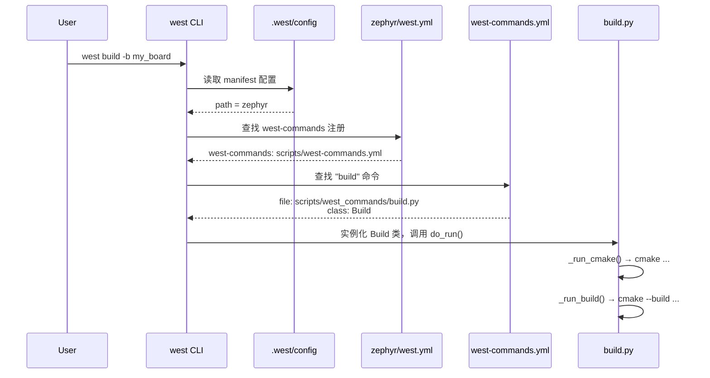
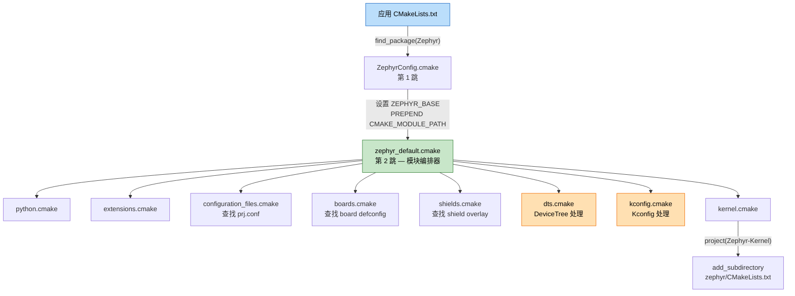
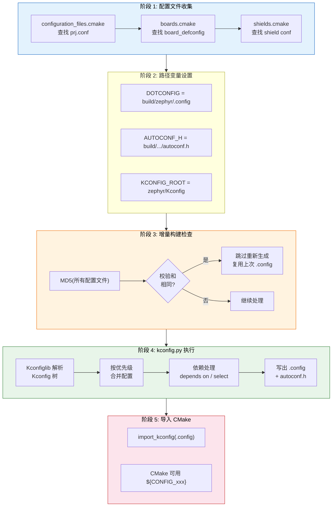
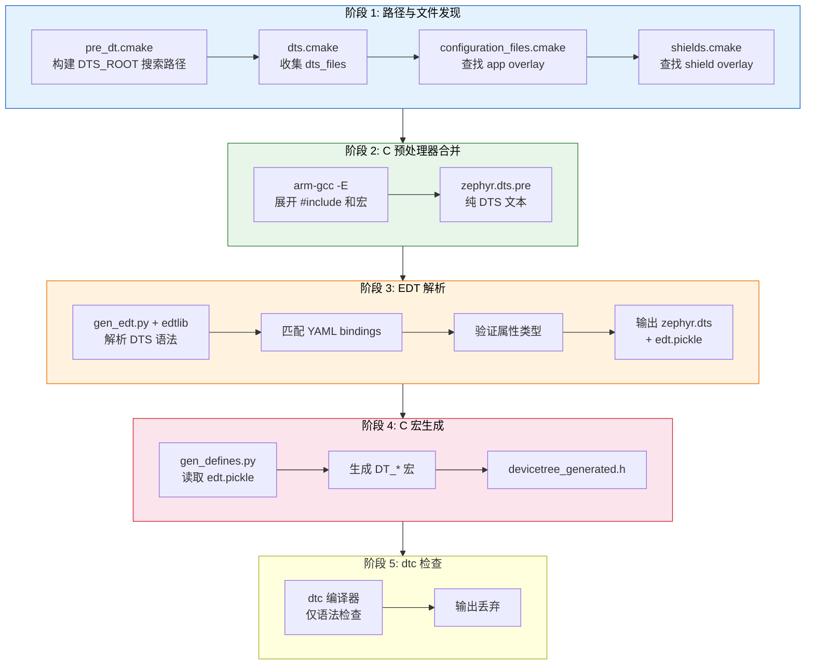
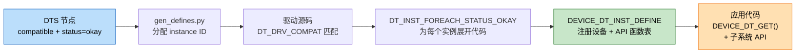
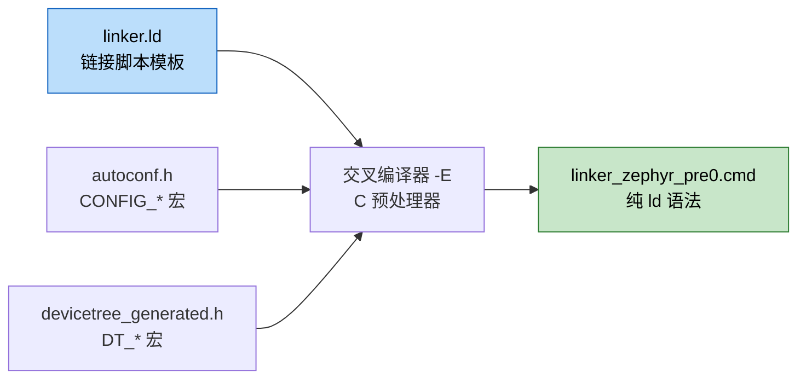
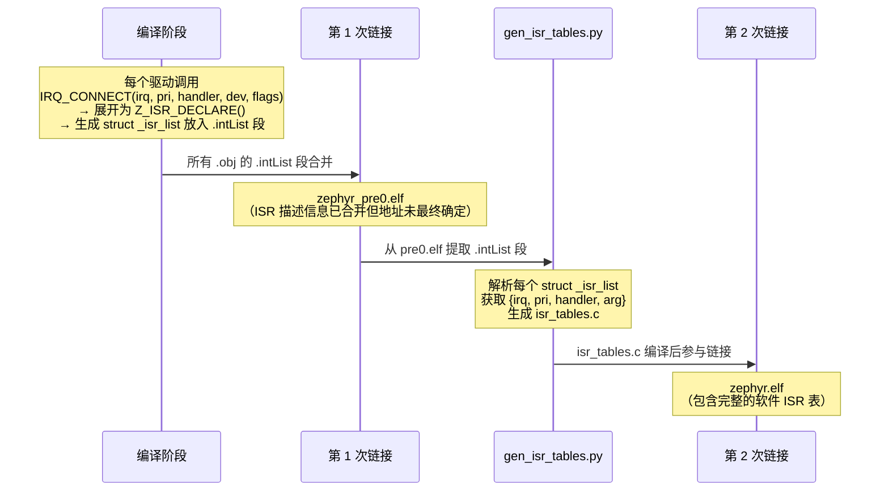
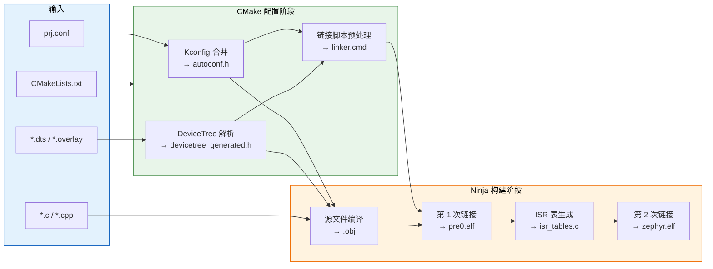

<center>
Zephyr RTOS 的构建系统涉及 west、CMake、Kconfig、DeviceTree、Ninja 五个工具的协作。本文逐层追踪 `west build` 命令从敲下回车到生成 `.elf` 文件的每一步，涵盖 Kconfig 配置合并、DeviceTree 设备树解析、链接脚本生成、以及两次链接机制等核心环节。
</center>
<!--more-->

*** 

> **Zephyr 版本**: v4.3.0-dev | **west 版本**: v1.5.0 | **适用架构**: ARM Cortex-M（本文以 Cortex-M 为例，其他架构流程类似）


## 1. 为什么要理解编译流程

Zephyr 的构建系统不是单一工具，而是 west、CMake、Kconfig、DeviceTree、Ninja 五个工具的协作链。每个工具负责不同层面的职责：

| 工具 | 职责 |
|------|------|
| **west** | 多仓库管理 + 构建命令入口 |
| **CMake** | 构建系统编排，协调各模块 |
| **Kconfig** | 软件配置（哪些功能启用、参数值多少） |
| **DeviceTree** | 硬件描述（有哪些外设、地址在哪、引脚怎么接） |
| **Ninja** | 构建执行器（并行编译、增量构建） |

理解这条链路，意味着你能回答这些问题：

- `prj.conf` 中的配置经过哪些步骤才生效？为什么它的优先级高于板级默认配置？
- 写了一个 `.overlay` 文件，构建系统是怎么发现并合并它的？
- 自定义的 YAML binding 放在哪个目录才能被识别？
- 链接脚本中的 `CONFIG_*` 和 `DT_*` 宏是从哪里来的？
- 为什么需要两次链接？第二次链接和第一次有什么不同？

本文从 `west build` 命令开始，逐层追踪整个编译过程。

本文将追踪以下命令的完整生命周期：

```bash
west build -b <board> <app_dir>
```

---

## 2. 编译全景概览

在深入每个阶段之前，先建立整体认知。一次完整的 `west build` 分为四个阶段：

```mermaid
flowchart LR
    subgraph P1["Phase 1: west 命令"]
        A["west build<br/>命令解析"] --> B["build.py<br/>参数组装"]
        B --> C["cmake -GNinja<br/>调用 CMake"]
    end

    subgraph P2["Phase 2: CMake 配置"]
        D["CMakeLists.txt<br/>加载链"] --> E["Kconfig<br/>配置合并"]
        E --> F["DeviceTree<br/>解析生成"]
        F --> G["链接脚本<br/>预处理"]
        G --> H["build.ninja<br/>生成"]
    end

    subgraph P3["Phase 3: Ninja 构建"]
        I["源文件编译<br/>.c/.cpp → .obj"] --> J["第 1 次链接<br/>zephyr_pre0.elf"]
        J --> K["gen_isr_tables.py<br/>ISR 表生成"]
        K --> L["第 2 次链接<br/>zephyr.elf"]
    end

    subgraph P4["Phase 4: 产物"]
        M["zephyr.elf<br/>zephyr.bin<br/>zephyr.hex"]
    end

    C --> D
    H --> I
    L --> M

    style P1 fill:#e3f2fd,stroke:#1565c0,color:#000
    style P2 fill:#e8f5e9,stroke:#2e7d32,color:#000
    style P3 fill:#fff3e0,stroke:#ef6c00,color:#000
    style P4 fill:#fce4ec,stroke:#c62828,color:#000
```



每个阶段的输入和输出：

| 阶段 | 输入 | 核心处理 | 输出 |
|------|------|---------|------|
| Phase 1 | 命令行参数 | west → build.py → cmake | CMake 进程启动 |
| Phase 2 | 源码 + 配置 + DTS | CMake 配置 | `build.ninja` + 生成文件 |
| Phase 3 | `build.ninja` + 源码 | Ninja → gcc → ld | `zephyr.elf` |
| Phase 4 | `zephyr.elf` | objcopy | `.bin` / `.hex` |

---

## 3. 环境准备与 west build 启动

### 3.1 虚拟环境与工具链

Zephyr 使用 Python 虚拟环境管理依赖（west、kconfiglib、dtshlib 等）：

```bash
# 激活虚拟环境
source .venv/bin/activate         # Linux/macOS
.\.venv\Scripts\Activate.ps1      # Windows
```

激活后，`west`、`cmake`、`ninja`、`python` 以及交叉编译工具链（如 `arm-zephyr-eabi-gcc`）均可用。

### 3.2 west build 的发现机制：命令如何路由到 build.py

当你敲下 `west build` 时，west 怎么知道该执行哪个 Python 文件？这涉及一个三步注册链路：



对应的配置文件链：

```ini
# .west/config — Step 1: 指定 manifest 项目路径
[manifest]
path = zephyr
```

```yaml
# zephyr/west.yml — Step 2: 声明扩展命令入口
self:
  west-commands: scripts/west-commands.yml
```

```yaml
# zephyr/scripts/west-commands.yml — Step 3: 注册具体命令
- file: scripts/west_commands/build.py
  commands:
    - name: build
      class: Build
```

### 3.3 参数解析与 CMake 调用

`build.py` 的 `do_run()` 方法分两步走：

```python
# zephyr/scripts/west_commands/build.py
def do_run(self, ...):
    self._run_cmake()    # Step 1: 调用 cmake 生成 build.ninja
    self._run_build()    # Step 2: 调用 cmake --build 执行编译
```

**Step 1：组装 CMake 参数**

```python
# build.py 组装的参数（简化）
final_cmake_args = [
    f'-DWEST_PYTHON={sys.executable}',      # Python 解释器路径
    f'-B{self.build_dir}',                   # 构建输出目录
    f'-G{DEFAULT_CMAKE_GENERATOR}',          # -G Ninja（硬编码在 zcmake.py）
    f'-DBOARD={board}',                      # 目标板
    f'-DSHIELD={";".join(shields)}',         # Shield 列表（分号分隔）
]
```

其中 `DEFAULT_CMAKE_GENERATOR = 'Ninja'` 硬编码在 `zcmake.py` 中，这是 west 默认使用 Ninja 而非 Make 的原因。

**构建目录如何确定**

`-B` 参数指定构建输出目录（即 `self.build_dir`），这个值由 `find_build_dir()` 函数按优先级链确定：

```python
# zephyr/scripts/west_commands/build.py
def find_build_dir(dir, guess=False, **kwargs):
    build_dir = dir                          # 优先级1: -d 参数显式指定
    dir_fmt = config.get('build', 'dir-fmt') # west config 配置的目录格式
    if not build_dir and is_zephyr_build(dir_fmt):
        build_dir = dir_fmt                  # 优先级2: dir-fmt 且已是构建目录
    if not build_dir and is_zephyr_build(cwd):
        build_dir = cwd                      # 优先级3: 当前工作目录就是构建目录
    if not build_dir and dir_fmt:
        build_dir = dir_fmt                  # 优先级4: dir-fmt（不管存不存在）
    if not build_dir:
        build_dir = DEFAULT_BUILD_DIR        # 优先级5: 兜底 "build"
```

`is_zephyr_build()` 通过检查 `CMakeCache.txt` 等标志文件判断目录是否是有效的 Zephyr 构建目录。`build.dir-fmt` 支持占位符（如 `{board}`），通过 `west config build.dir-fmt "build/{board}"` 配置，可以让不同板子自动使用不同构建目录。

大多数人不配 `-d` 也不配 `dir-fmt`，最终走到优先级 5，输出到应用目录下的 `build/`。

**Step 2：CMake 自动调用 Ninja**

```python
# zephyr/scripts/west_commands/zcmake.py
def run_build(build_directory, **kwargs):
    cmake = shutil.which('cmake')
    cmd = [cmake, '--build', build_directory] + extra_args
    subprocess.Popen(cmd, ...)
```

`cmake --build` 并不直接调用 gcc，而是读取 `CMakeCache.txt` 中缓存的 `CMAKE_GENERATOR=Ninja`，然后自动路由到 Ninja 执行器。这就是为什么你在控制台看不到显式的 `ninja` 命令。

等价于：

```bash
# Step 1: CMake 配置（生成构建规则）
cmake -GNinja -B build/ \
      -DBOARD=<board> \
      -DSHIELD=<shield1>;<shield2> \
      -S <app_dir>/

# Step 2: Ninja 构建（CMake 自动调用）
cmake --build build/
```

---

## 4. CMake 配置阶段

这是整个编译流程中最复杂的阶段。CMake 加载构建脚本、处理配置、解析设备树、生成链接脚本，最终输出 `build.ninja`。

### 4.0 CMake 如何找到应用的 CMakeLists.txt

在进入 CMake 配置之前，先回答一个基本问题：CMake 怎么知道要用哪个 `CMakeLists.txt`？

答案在 west build 传递给 cmake 的 `-S` 参数中。

**west build 的参数解析**（`build.py`）：

```python
# west build 的位置参数就是应用源码目录
# west build -b <board> <source_dir>
#                         ↑ 这个参数
self.args.source_dir    # 例如: "my_app/"
```

**build.py 将其传给 cmake 的 `-S` 参数**：

```python
# build.py 组装 CMake 参数时
final_cmake_args = [
    f'-S{self.args.source_dir}',      # -S 告诉 CMake 源码在哪
    f'-B{self.build_dir}',            # -B 告诉 CMake 输出到哪
    f'-G{DEFAULT_CMAKE_GENERATOR}',   # -G Ninja
    f'-DBOARD={board}',
]
```

**CMake 收到 `-S <app_dir>` 后**，按标准规则在该目录下查找 `CMakeLists.txt`：

```
cmake -S my_app/ -B build/ -G Ninja ...
  → CMake 自动查找 my_app/CMakeLists.txt
  → 找到后，开始执行其中的 CMake 指令
```

这就是为什么每个 Zephyr 应用的根目录下必须有一个 `CMakeLists.txt` —— 它是 CMake 的标准入口文件，文件名不可更改。

**如果没有指定 source_dir**：west 默认使用当前工作目录作为 source_dir，所以直接在应用目录下执行 `west build -b <board>` 也能工作。

### 4.1 CMakeLists.txt 加载链

一切从应用的 `CMakeLists.txt` 开始：

```cmake
# <app_dir>/CMakeLists.txt — 每个应用的构建入口
cmake_minimum_required(VERSION 3.20.0)
find_package(Zephyr REQUIRED HINTS $ENV{ZEPHYR_BASE})
project(my_app)
```

`find_package(Zephyr)` 触发的加载链：



**关键细节**：

1. **`ZEPHYR_BASE` 解析优先级**：环境变量 `$ENV{ZEPHYR_BASE}` → CMake Cache → 文件路径推算

2. **模块加载顺序**由 `zephyr_default.cmake` 的 `foreach` 循环控制。**DeviceTree 在 Kconfig 之前处理**：
   ```cmake
   list(APPEND zephyr_cmake_modules dts)       # 先
   list(APPEND zephyr_cmake_modules kconfig)   # 后
   ```

3. **安全保护**：`zephyr/CMakeLists.txt` 开头检查 `ZEPHYR_BINARY_DIR` 是否已定义，确保自己是被 `kernel.cmake` 通过 `add_subdirectory` 调用的，而不是被用户误操作直接 cmake

### 4.2 Kconfig 配置系统详解

Kconfig 管理"软件层面"的配置：哪些功能启用、缓冲区多大、调试输出级别等。它不是简单的键值对拼接，而是一个带依赖关系的配置管理系统。

#### 4.2.1 处理流程



#### 4.2.2 配置文件优先级

Kconfig 按优先级合并配置，后者覆盖前者：

| 优先级 | 文件 | 来源 | 说明 |
|--------|------|------|------|
| 1（最低） | `<board>_defconfig` | 板级默认 | 板子能跑的最基础配置 |
| 2 | `<board>_revision.conf` | 板级修订 | 特定硬件版本的配置 |
| 3 | 板级扩展 conf | 板级扩展目录 | 额外板级配置 |
| 4 | `prj.conf` | **应用配置** | 开发者自己写的配置 |
| 5 | Shield conf | Shield 目录 | 扩展板配置 |
| 6 | 额外 conf | 命令行指定 | `--extra-conf-file` |
| 7（最高） | `EXTRA_KCONFIG_OPTIONS` | 命令行选项 | 强制覆盖 |

这意味着你的 `prj.conf` 可以覆盖板级默认，但可以被命令行选项覆盖。

#### 4.2.3 Kconfig 树的解析

`kconfig.py` 使用 **Kconfiglib** 从 `KCONFIG_ROOT`（通常是 `zephyr/Kconfig`）开始递归解析整棵 Kconfig 树：

```python
# zephyr/scripts/kconfig/kconfig.py 核心逻辑
def main():
    # 1. 递归解析 Kconfig 树（处理 source/rsource 等指令）
    kconf = Kconfig(args.kconfig_file)           # zephyr/Kconfig

    # 2. 按优先级加载配置文件
    kconf.load_config(defconfig)                  # 最低优先级
    for config in remaining_configs:
        kconf.load_config(config, replace=False)  # 后者覆盖前者

    # 3. 处理依赖关系
    # depends on — 条件不满足时选项不可见
    # select — 强制启用某个选项
    # default — 无显式设置时的默认值
    # imply — 建议启用但不强制

    # 4. 合法性检查
    check_no_promptless_assign(kconf)   # 检查无 prompt 符号是否被赋值
    check_assigned_sym_values(kconf)    # 检查赋值是否生效（依赖未满足？）

    # 5. 写出输出文件
    kconf.write_config(args.config_out)    # → build/zephyr/.config
    kconf.write_autoconf(args.header_out)  # → build/.../autoconf.h
```

#### 4.2.4 输出文件

**`.config`**（供 CMake 和脚本读取）：
```makefile
CONFIG_MAIN_STACK_SIZE=2048
CONFIG_SERIAL=y
CONFIG_UART_CONSOLE=y
```

**`autoconf.h`**（供 C 源码和链接脚本使用）：
```c
#define CONFIG_MAIN_STACK_SIZE 2048
#define CONFIG_SERIAL 1
#define CONFIG_UART_CONSOLE 1
```

通过 `-imacros autoconf.h` 编译选项，所有 C 源文件和链接脚本模板都能使用 `CONFIG_*` 宏。在 CMake 中则通过 `import_kconfig()` 使 `${CONFIG_xxx}` 变量可用。

---

### 4.3 DeviceTree 处理详解

如果说 Kconfig 管"软件配置"，那 DeviceTree 管"硬件描述"：SoC 有哪些外设、寄存器地址在哪、中断号是多少、引脚怎么复用。这是编译流程中涉及文件最多、环节最复杂的部分。

#### 4.3.1 处理流程总览



#### 4.3.2 阶段 1: DTS 文件发现与优先级

**DTS_ROOT 搜索路径构建**（`pre_dt.cmake`）：

```cmake
list(APPEND DTS_ROOT
    ${APPLICATION_SOURCE_DIR}    # 应用目录（自定义 binding/overlay 在此）
    ${BOARD_DIR}                 # 板级目录
    ${SHIELD_DIRS}               # Shield 目录
    ${ZEPHYR_BASE}               # Zephyr 主目录
)
```

对每个 DTS_ROOT 目录，搜索以下子路径作为 `#include` 搜索目录：
- `include/` — C 头文件
- `dts/<arch>/` — 架构特定 DTS（如 `dts/arm/`）
- `dts/common/` — 通用 DTS
- `dts/bindings/` — YAML binding 文件

**DTS 文件按优先级收集**（`dts.cmake`）：

| 序号 | 文件来源 | 说明 |
|------|---------|------|
| 1 | Board DTS 主文件（`<board>.dts`） | 硬件基础定义，最高优先级的基础 |
| 2 | Board 扩展 DTS | 额外板级定义 |
| 3 | Shield overlay 文件 | 扩展板硬件 |
| 4 | 应用 overlay | 开发者自定义覆盖 |
| 5 | 额外 overlay（命令行） | `-DDTC_OVERLAY_FILE`，最高优先级 |

应用 overlay 的自动发现顺序：
1. `<app>/boards/socs/` 目录下的 SoC 特定 overlay
2. `<app>/boards/` 目录下的板级特定 overlay
3. `<app>/` 目录下任意 `.overlay` 文件
4. `<app>/app.overlay`

Board DTS 本身也有 include 层级链，以 STM32H7 为例：

```
<board>.dts                          ← Board DTS（入口）
  └─ stm32h747Xi_m7.dtsi            ← M7 核心定义
       └─ stm32h747.dtsi             ← 特定型号（MIPI-DSI、Flash 容量）
            └─ stm32h745.dtsi        ← 系列（SRAM、外设列表）
                 └─ stm32h7.dtsi     ← 基础 SoC（所有 H7 共用外设）
                      └─ armv7-m.dtsi ← ARM 架构基础（NVIC、systick）
```

越底层的 `.dtsi` 越通用，越上层的 `.dts` 越具体。

#### 4.3.3 阶段 2: C 预处理器合并

DTS 文件中大量使用 C 预处理器指令，必须先用交叉编译器的预处理器展开：

```dts
#include <st/h7/stm32h7.dtsi>                  /* #include 被展开 */
#include <zephyr/dt-bindings/gpio/gpio.h>      /* 宏定义被展开 */
reg = <0x08000000 DT_SIZE_K(1024)>;            /* 宏被计算为实际值 */
pinmux = <STM32_PINMUX('A', 9, AF7)>;          /* 宏被展开为 0x127 */
```

预处理命令（简化）：

```bash
<cross>-gcc \
    -x assembler-with-cpp \       # 将 DTS 当作汇编来预处理
    -nostdinc -D__DTS__ \         # 不使用标准库，标记 DTS 模式
    -isystem zephyr/dts/arm \     # DTS_ROOT 下的 include 路径
    -include board.dts \          # 按顺序 -include 所有 dts_files
    -include shield.overlay \
    -include app.overlay \
    -E -o zephyr.dts.pre          # 只做预处理，输出纯 DTS
```

**`-include` 的合并效果**：多个文件通过 `-include` 传入，等效于在虚拟文件顶部按顺序拼接。Overlay 中 `&usart1` 这样的标签引用，因为 Board DTS 先被 `-include`，标签已存在于符号表中，所以能正确解析。

**输出**：`build/zephyr/zephyr.dts.pre` — 所有 `#include` 和宏展开后的纯 DTS 文本。

#### 4.3.4 阶段 3: EDT 解析与 Binding 匹配

`gen_edt.py` 使用 Python 库 `edtlib` 解析预处理后的 DTS：

```python
# zephyr/scripts/dts/gen_edt.py
edt = edtlib.EDT(
    args.dts,                # zephyr.dts.pre
    args.bindings_dirs,      # 所有 DTS_ROOT 下的 dts/bindings/ 目录
    vendor_prefixes=...      # 厂商前缀映射（st=STMicroelectronics 等）
)
```

edtlib 做了四件事：

1. **解析 DTS 语法**：节点、属性、`&label` 引用、`&node { ... }` 覆盖
2. **加载 YAML bindings**：根据每个节点的 `compatible` 属性匹配 binding 文件
3. **验证属性类型**：检查 `reg`、`interrupts` 等属性是否符合 binding 中的类型定义
4. **合并 overlay 覆盖**：处理 `&node { status = "okay"; }` 等覆盖操作

**Binding 发现机制**：
- Zephyr 扫描所有 `<DTS_ROOT>/dts/bindings/**/*.yaml`
- Binding 文件名必须与 `compatible` 字符串匹配（`vendor,model` → `vendor,model.yaml`）
- 应用目录下创建 `dts/bindings/` 子目录即可添加自定义 binding
- 没有 matching binding 的节点，`DT_PROP()` 宏无法访问其自定义属性

**完整示例：从 DTS 到驱动的自定义设备**

以一个自定义 I2C 温度传感器为例，展示 DTS → binding → 驱动 → API 的完整链路。

**Step 1：DTS 中定义设备节点**

```dts
/* app.overlay — 声明硬件 */
&i2c1 {
    my_temp: my_temp@48 {
        compatible = "acme,tmp100";
        reg = <0x48>;                  /* I2C 从地址 */
        status = "okay";
        sampling-rate = <10>;          /* 自定义属性：采样率 Hz */
        alert-threshold = <75>;        /* 自定义属性：告警阈值 °C */
    };
};
```

**Step 2：编写 binding YAML**

放在 `<app_dir>/dts/bindings/sensor/acme,tmp100.yaml`：

```yaml
description: ACME TMP100 I2C temperature sensor

compatible: "acme,tmp100"

include: [i2c-device.yaml]    # 继承 I2C 设备通用属性（reg、bus 等）

properties:
  sampling-rate:
    type: int
    required: true
    description: Sampling rate in Hz
  alert-threshold:
    type: int
    default: 80               # 可选属性，有默认值
    description: Alert threshold in degrees Celsius
```

**Step 3：编写驱动**

```c
/* drivers/sensor/acme_tmp100.c — 关键框架 */

/* 声明此驱动匹配的 compatible */
#define DT_DRV_COMPAT acme_tmp100

/* 设备私有数据结构 */
struct tmp100_data {
    int16_t temp_raw;
};

/* 设备配置结构（从 DTS 获取） */
struct tmp100_config {
    struct i2c_dt_spec i2c;       /* I2C 总线 + 地址（来自 reg） */
    int sampling_rate;             /* 来自 sampling-rate 属性 */
    int alert_threshold;           /* 来自 alert-threshold 属性 */
};

/* 传感器 API 实现 */
static int tmp100_sample_fetch(const struct device *dev,
                               enum sensor_channel chan)
{
    const struct tmp100_config *cfg = dev->config;
    struct tmp100_data *data = dev->data;
    /* 通过 I2C 读取温度寄存器（16-bit） */
    return i2c_burst_read_dt(&cfg->i2c, 0x00, (uint8_t *)&data->temp_raw, 2);
}

static int tmp100_channel_get(const struct device *dev,
                              enum sensor_channel chan,
                              struct sensor_value *val)
{
    struct tmp100_data *data = dev->data;
    val->val1 = data->temp_raw / 256;
    val->val2 = (data->temp_raw % 256) * 1000000 / 256;
    return 0;
}

/* 传感器 API 函数表 */
static const struct sensor_driver_api tmp100_api = {
    .sample_fetch = tmp100_sample_fetch,
    .channel_get  = tmp100_channel_get,
};

/* 初始化函数 */
static int tmp100_init(const struct device *dev)
{
    const struct tmp100_config *cfg = dev->config;
    if (!device_is_ready(cfg->i2c.bus)) {
        return -ENODEV;
    }
    return 0;
}

/* ★ 核心：为每个 DTS 中 status="okay" 的节点生成一个设备实例 */
#define TMP100_INIT(inst)                                           \
    static struct tmp100_data data_##inst;                          \
    static const struct tmp100_config config_##inst = {             \
        .i2c = I2C_DT_SPEC_INST_GET(inst),                         \
        .sampling_rate = DT_INST_PROP(inst, sampling_rate),         \
        .alert_threshold = DT_INST_PROP(inst, alert_threshold),     \
    };                                                              \
    DEVICE_DT_INST_DEFINE(inst, tmp100_init, NULL,                  \
                          &data_##inst, &config_##inst,             \
                          POST_KERNEL, CONFIG_SENSOR_INIT_PRIORITY, \
                          &tmp100_api);

DT_INST_FOREACH_STATUS_OKAY(TMP100_INIT);
```

**Step 4：应用代码使用**

```c
/* 应用代码 — 通过标准传感器 API 访问 */
const struct device *temp = DEVICE_DT_GET(DT_NODELABEL(my_temp));

sensor_sample_fetch(temp);
struct sensor_value val;
sensor_channel_get(temp, SENSOR_CHAN_AMBIENT_TEMP, &val);
printk("Temperature: %d.%06d °C\n", val.val1, val.val2);
```

**完整的数据流转**：

```
DTS 节点 (compatible="acme,tmp100", status="okay")
    ↓ gen_defines.py 为此节点分配 instance ID (inst=0)
驱动 DT_DRV_COMPAT = "acme_tmp100" 匹配
    ↓ DT_INST_FOREACH_STATUS_OKAY 展开 TMP100_INIT(0)
DEVICE_DT_INST_DEFINE 注册设备实例
    ↓ config_0 从 DTS 读取: i2c 总线, sampling_rate=10, alert_threshold=75
应用 DEVICE_DT_GET(DT_NODELABEL(my_temp)) 获取设备
    ↓ 调用 sensor_sample_fetch() / sensor_channel_get()
```

关键宏的作用：
- `DT_DRV_COMPAT` — 声明驱动匹配哪个 compatible（`acme,tmp100` → C 标识符 `acme_tmp100`）
- `DT_INST_FOREACH_STATUS_OKAY` — 为每个匹配且 status=okay 的 DTS 节点展开一次初始化代码
- `DT_INST_PROP(inst, prop)` — 获取第 inst 个实例的属性值（如 `sampling_rate` = 10）
- `DEVICE_DT_INST_DEFINE` — 将设备注册到内核，绑定 API 函数表
- `DEVICE_DT_GET` — 应用代码通过 DTS 标签获取设备句柄

**输出**：
- `build/zephyr/zephyr.dts` — 合并后的完整设备树（调试时打开查看最终结果）
- `build/zephyr/edt.pickle` — EDT 对象的 Python pickle 序列化

#### 4.3.5 阶段 4: C 宏生成

`gen_defines.py` 读取 `edt.pickle`，为每个 DTS 节点生成 C 预处理器宏：

```c
/* build/zephyr/include/generated/zephyr/devicetree_generated.h */

/* 节点标识 — 将 nodelabel 映射到节点路径 */
#define DT_NODELABEL_usart1          DT_N_S_soc_S_serial_40011000

/* 寄存器地址和大小 */
#define DT_N_S_soc_S_serial_40011000_P_reg_0_ADDR    0x40011000
#define DT_N_S_soc_S_serial_40011000_P_reg_0_SIZE    0x400

/* 中断信息 */
#define DT_N_S_soc_S_serial_40011000_P_interrupts_0_IRQ    37
#define DT_N_S_soc_S_serial_40011000_P_interrupts_0_PRI    0

/* 节点状态 */
#define DT_NODE_HAS_STATUS(DT_NODELABEL_usart1, okay)  1

/* chosen 映射 */
#define DT_CHOSEN_zephyr_console    DT_NODELABEL_usart1
```

这些宏让 C 代码在**编译时**就能获取硬件信息，无需运行时查找。应用代码通过 `<zephyr/devicetree.h>` 提供的 `DT_NODELABEL()`、`DT_PROP()`、`DT_IRQ()` 等高层宏间接使用这些底层定义。

#### 4.3.6 阶段 5: dtc 检查（可选）

```cmake
# dts.cmake — 如果系统安装了 dtc（Device Tree Compiler）
if(DTC)
    execute_process(COMMAND ${DTC}
        -O dts -o - -b 0 -E unit_address_vs_reg
        ${ZEPHYR_DTS}     # 输入: zephyr.dts
        OUTPUT_QUIET       # 输出丢弃
    )
endif()
```

dtc 在 Zephyr 中**仅做语法和一致性检查**，输出被完全丢弃。实际的 DTS 解析、合并和 C 宏生成由 Python 工具链（edtlib + gen_defines.py）完成。

#### 4.3.7 DeviceTree 核心概念

理解了处理流程后，以下是从 DTS 到驱动的关键概念：

**compatible — 驱动匹配的钥匙**

```dts
compatible = "st,stm32h7-dma", "st,stm32-dma-v2";
```

- 格式：`"vendor,model"`（全小写，逗号分隔）
- 多值按 **specific → generic** 顺序排列
- 每个 compatible 独立匹配驱动，**不是**"第一个匹配就停止"
- Zephyr 依靠 Kconfig 的 `depends on` 确保只有一个驱动被编译
- 没有 `compatible` 的节点无法匹配驱动，但可以被 `&label` 引用和 `DT_PROP()` 访问

**驱动模型匹配链 — DTS 如何绑定到驱动**：



关键理解：匹配是**编译时**完成的。宏展开后，驱动代码为每个 DTS 中 `status = "okay"` 的节点生成一个设备实例，注册到内核设备列表中。没有运行时的设备名查找。

**reg — 寄存器地址映射**

`reg` 属性的格式由**父节点**的属性决定：

| 父节点属性 | 作用 |
|-----------|------|
| `#address-cells` | 地址占几个 32-bit cell |
| `#size-cells` | 大小占几个 32-bit cell |
| `bus`（binding 中定义） | 决定地址 cell 的含义 |

典型格式对比：

```dts
/* 内存映射总线：reg = <地址 大小> */
soc {
    #address-cells = <1>;
    #size-cells = <1>;
    serial@40011000 {
        reg = <0x40011000 0x400>;      /* 地址 0x40011000, 大小 1KB */
    };
};

/* SPI/QSPI 总线：reg = <片选号>（#size-cells = 0）*/
qspi {
    #address-cells = <1>;
    #size-cells = <0>;
    flash@0 {
        reg = <0x0>;                    /* 片选 0 */
    };
};
```

节点名中的 `@address` 是给人看的标识符，`reg` 是给驱动用的数据。DTS 规范要求两者匹配。

**interrupts — 中断配置**

中断格式由 `interrupt-parent` 指向的中断控制器 binding 决定。以 ARM Cortex-M 的 NVIC 为例：

```yaml
# zephyr/dts/bindings/interrupt-controller/arm,v7m-nvic.yaml
"#interrupt-cells":
  const: 2

interrupt-cells:
  - irq        # 中断号
  - priority   # 优先级
```

```dts
dma1: dma@40020000 {
    compatible = "st,stm32-dma-v2";
    /* 4 个 stream，每个 2 个 cell（irq, priority）*/
    interrupts = <11 0, 12 0, 13 0, 14 0>;
};
```

多个中断拼接为数组，构建工具按 `#interrupt-cells` 的值自动分割。

**pinctrl — 引脚复用配置**

STM32 的 pinctrl 分两层 binding：
1. `pinctrl-device.yaml` — 定义 `pinctrl-0` 为 phandle 类型
2. `st,stm32-pinctrl.yaml` — 通过 child-binding 定义 pin 配置节点格式

```dts
usart1_tx_default: usart1_tx_default {
    pinmux = <STM32_PINMUX('A', 9, AF7)>;  /* PA9 作为 USART1_TX */
    bias-pull-up;                            /* 上拉 */
    drive-push-pull;                         /* 推挽输出 */
};
```

`STM32_PINMUX('A', 9, AF7)` 经 C 预处理器展开为一个 32-bit 整数，编码为：
- bit[13:9] = port（A=0, B=1, ...）
- bit[8:5] = line（0-15）
- bit[4:0] = mode（AF0-AF15 或 GPIO 模式）

**chosen — 系统级节点选择**

Zephyr 通过 `chosen` 属性将 DTS 节点映射到系统功能：

```dts
chosen {
    zephyr,flash           = &flash0;    /* 代码存储位置 → 影响链接脚本 */
    zephyr,console         = &usart1;    /* 默认控制台 UART */
    zephyr,sram            = &sram0;     /* 主 SRAM → 链接脚本 RAM 区域 */
    zephyr,flash-controller = &flash;    /* 默认 Flash 操作设备 */
    zephyr,shell-backend   = &usart1;    /* Shell 后端 */
};
```

注意 `zephyr,flash` 和 `zephyr,flash-controller` 是独立的：
- `zephyr,flash` → 代码存在哪（决定链接脚本的 FLASH 区域 ORIGIN/LENGTH）
- `zephyr,flash-controller` → 用哪个设备执行 Flash 操作（影响 flash API）

**Label 与 phandle**

```dts
usart1: serial@40011000 { ... };
/*↑       ↑
  label   node_name
*/
```

- **节点名** (`serial@40011000`)：硬件描述，DTS 规范要求用 `@address` 区分同类型节点
- **Label** (`usart1:`)：人类可读别名，用于 `&usart1` 跨文件引用和 `DT_NODELABEL()` 宏
- **phandle**：构建系统自动生成的数字 ID，只有被 `&label` 引用的节点才会分配。在 `zephyr.dts` 中可见（如 `phandle = <0x3>`），但永远不需要手动编写

一个节点可以有多个 label，但**只能在节点定义时声明**，overlay 中无法追加：

```dts
/* 两个 label 都在节点定义时给出（通常在同一个 dtsi 中） */
dcmi: st_cam_dvp: dcmi@48020000 { ... };
```

---

### 4.4 链接脚本生成

链接脚本定义了代码和数据在物理内存中的布局。Zephyr 的链接脚本模板经过 C 预处理，可以动态适配不同硬件的内存配置。

#### 4.4.1 模板选择

选择优先级：应用自定义 > 板级 > SoC > 架构默认。

```
SOC CMakeLists.txt → 设置 SOC_LINKER_SCRIPT
    = zephyr/include/zephyr/arch/arm/cortex_m/scripts/linker.ld
        ↓ CMake 使用此模板
    → linker_zephyr_pre0.cmd（预处理后）
```

对于 ARM Cortex-M，默认模板位于：
`zephyr/include/zephyr/arch/arm/cortex_m/scripts/linker.ld`

#### 4.4.2 C 预处理



预处理命令：

```bash
<cross>-gcc -x assembler-with-cpp \
    -D_LINKER -D__GCC_LINKER_CMD__ \
    -imacros autoconf.h \          # 注入所有 CONFIG_* 宏
    -E linker.ld -P \              # 预处理，去除 #line 指令
    -o linker_zephyr_pre0.cmd      # 输出纯 ld 语法
```

GNU ld 本身不支持 `#include`，但链接脚本先经过 C 预处理器，因此：
- `#include` 指令被正常展开
- `CONFIG_SRAM_BASE_ADDRESS` 等 Kconfig 宏被替换为实际值
- `DT_REG_ADDR(node)` 等 DeviceTree 宏被替换为实际地址
- `LINKER_DT_REGIONS()` 展开为 DeviceTree 中定义的所有内存区域

#### 4.4.3 预处理后的链接脚本

```ld
/* linker_zephyr_pre0.cmd — 预处理后的关键部分 */
OUTPUT_FORMAT("elf32-littlearm")
MEMORY
{
    FLASH (rx) : ORIGIN = ...,      LENGTH = ...
    RAM   (wx) : ORIGIN = ...,      LENGTH = ...
    /* 以下来自 DeviceTree 的 zephyr,memory-region 节点 */
    SDRAM2(rw) : ORIGIN = 0xD0000000, LENGTH = 33554432
}
ENTRY("__start")
SECTIONS
{
    GROUP_START(ROMABLE_REGION)
        .rom_start  { ... }         /* 中断向量表 */
        .text       { ... }         /* 代码 */
        .rodata     { ... }         /* 只读数据 */
    GROUP_END(ROMABLE_REGION)

    GROUP_START(RAMABLE_REGION)
        .datas      { ... }         /* 已初始化数据 */
        .bss        { ... }         /* 未初始化数据 */
        .noinit     { ... }         /* 不清零数据 */
    GROUP_END(RAMABLE_REGION)
}
```

额外的 MEMORY 区域来自 DeviceTree 中的 `zephyr,memory-region` 节点：

```dts
sdram2: sdram@d0000000 {
    compatible = "zephyr,memory-region", "mmio-sram";
    reg = <0xd0000000 0x2000000>;         /* 32MB */
    zephyr,memory-region = "SDRAM2";       /* 链接脚本中的区域名 */
    zephyr,memory-attr = <0x100000>;       /* 内存属性 */
};
```

`zephyr,memory-attr` 的位域布局（定义在 `zephyr/include/zephyr/dt-bindings/memory-attr/`）：

| 位段 | 范围 | 用途 | 示例 |
|------|------|------|------|
| bit[15:0] | 通用属性 | cacheable, DMA 等 | `DT_ATTR_DMA_READY` |
| bit[19:16] | 软件自定义 | 应用层定义 | — |
| bit[31:20] | 架构特定 | ARM MPU 属性 | `DT_MEM_ARM(ATTR_MPU_RAM)` |

`0x100000` 即 `DT_MEM_ARM(ATTR_MPU_RAM)`，表示普通 RAM 的 MPU 属性。

#### 4.4.4 从 linker_zephyr_pre0.cmd 到最终 linker.cmd

前面介绍的是 CMake 配置阶段生成的 `linker_zephyr_pre0.cmd`。在实际构建中，链接脚本会经历**多次预处理**，每次从同一个 `linker.ld` 模板出发，但传入不同的宏定义：

```
CMake 配置阶段:
    linker.ld + -DLINKER_ZEPHYR_PRE0  → linker_zephyr_pre0.cmd  ← 4.4.2 节介绍的

Ninja 构建阶段:
    linker_zephyr_pre0.cmd → 第 1 次链接 → zephyr_pre0.elf
    zephyr_pre0.elf → gen_isr_tables.py → isr_tables.c
    linker.ld + -DLINKER_ZEPHYR_FINAL → linker.cmd              ← 最终链接脚本
    linker.cmd + isr_tables.o → 第 2 次链接 → zephyr.elf
```

**核心机制**：`configure_linker_script()` 宏（`cmake/linker/ld/target.cmake`）对同一个 `linker.ld` 模板执行 GCC 预处理，通过不同的 `-D` 宏控制条件分支：

```cmake
# zephyr/CMakeLists.txt:1704-1713
# The final linker pass uses the same source linker script of the
# previous passes, but this time with a different output file and
# preprocessed with the define LINKER_ZEPHYR_FINAL.
configure_linker_script(
  linker.cmd                       # ← 输出文件名
  "LINKER_ZEPHYR_FINAL"            # ← 额外的 -D 宏
  ...
)
```

预处理命令对比：

```bash
# 第 1 次（CMake 配置阶段）
<cross>-gcc -D_LINKER -DLINKER_ZEPHYR_PRE0 \
    -imacros autoconf.h -E linker.ld -o linker_zephyr_pre0.cmd

# 最终（Ninja 构建阶段）
<cross>-gcc -D_LINKER -DLINKER_ZEPHYR_FINAL \
    -imacros autoconf.h -E linker.ld -o linker.cmd
```

**两份脚本的具体差异**：`linker.ld` 模板中有条件判断控制 `.intList` 段的处理方式：

```ld
/* linker.ld 模板中的条件逻辑（简化）*/
#ifdef LINKER_ZEPHYR_FINAL
  /DISCARD/ :
  {
    KEEP(*(.irq_info*))
    KEEP(*(.intList*))
  }
  /* 最终版：丢弃 .intList，因为 ISR 表已由 gen_isr_tables.py 生成 */
#else
  .intList :
  {
    KEEP(*(.irq_info*))
    KEEP(*(.intList*))
  } > IDT_LIST
  /* 中间版：保留 .intList 到 IDT_LIST 区域，供 gen_isr_tables.py 提取 */
#endif
```

实际对比两份预处理产物，只有这一处区别：

```ld
/* linker_zephyr_pre0.cmd — 第 1 次链接用 */
.intList : { KEEP(*(.intList*)) } > IDT_LIST    /* 保留 ISR 描述信息 */

/* linker.cmd — 最终链接用 */
/DISCARD/ : { KEEP(*(.intList*)) }               /* 丢弃，不再需要 */
```

如果项目没有启用 `CONFIG_GEN_ISR_TABLES`（不需要两次链接），则 `generated_kernel_files` 为空，构建系统直接将 `zephyr_pre0.elf` 作为最终产物，不会生成 `linker.cmd`，也跳过第二次链接。

---

## 5. Ninja 构建阶段

CMake 配置完成后，输出 `build.ninja` 文件。Ninja 根据其中的规则并行执行编译和链接。

### 5.1 源文件编译

Ninja 自动检测 CPU 核心数，并行调用交叉编译器：

```bash
# C 文件编译（简化）
<cross>-gcc -D_KERNEL -O2 -c \
    -imacros autoconf.h \          # Kconfig 宏
    -include devicetree_generated.h \  # DeviceTree 宏
    -o build/app/src/main.c.obj \
    src/main.c

# C++ 文件编译
<cross>-g++ -std=c++17 -fno-rtti -fno-exceptions -c \
    -o build/app/src/app.cpp.obj \
    src/app.cpp
```

每个 `.c`/`.cpp` 文件独立编译为 `.obj`（目标文件），然后进入链接阶段。

### 5.2 两次链接机制

Zephyr 使用**两次链接**生成最终 ELF，这是由 ARM Cortex-M 中断处理架构的特殊需求决定的。

**为什么需要两次链接？**

ARM Cortex-M 的硬件向量表（Vector Table）只存储函数指针，无法传递额外参数。但 Zephyr 驱动需要在中断处理函数中访问**设备上下文**（device context）。解决方案是引入软件 ISR 表作为间接层：

```
硬件中断 → 向量表中的通用入口 _isr_wrapper
              → 查找软件 ISR 表 → 获取 {handler, device_context}
                → 调用 handler(device_context)
```



**详细过程**：

**编译阶段** — 每个驱动通过 `IRQ_CONNECT` 注册中断处理：

```c
// 驱动初始化代码
IRQ_CONNECT(irq_num, priority, my_isr_handler, DEVICE_GET(my_dev), 0);

// 宏展开后，生成一个 linker section 条目
Z_ISR_DECLARE(0, irq_num, priority, my_isr_handler, &my_dev_data);

// 实际效果：将一个 struct 放入 .intList 段
__attribute__((section(".intList")))
static struct _isr_list _isr_entry = {
    .irq = irq_num,
    .priority = priority,
    .func = my_isr_handler,
    .arg = &my_dev_data,    // 设备上下文指针
};
```

**第 1 次链接** (`zephyr_pre0.elf`)：
- 合并所有 `.obj` 的 `.intList` 段
- 此时所有符号地址已确定

**ISR 表生成** (`gen_isr_tables.py`)：
- 从 `zephyr_pre0.elf` 读取 `.intList` 段的二进制数据
- 解析每个 `struct _isr_list` 条目
- 生成 `isr_tables.c`，包含排序后的软件 ISR 表

**第 2 次链接** (`zephyr.elf`)：
- `isr_tables.c` 被编译并参与最终链接
- 最终 ELF 包含完整的软件 ISR 表和所有设备上下文

> **为什么不一次搞定？** `DEVICE_GET(dev)` 获取的设备结构体地址，只有在所有目标文件链接后才能确定。第 1 次链接确定所有地址后，`gen_isr_tables.py` 才能生成正确的 ISR 表，第 2 次链接将其纳入最终产物。

> **触发条件**：`CONFIG_GEN_ISR_TABLES=y` 时启用两次链接。大多数 ARM Cortex-M 项目默认启用。

---

## 6. 最终产物

编译完成后，`build/zephyr/` 目录下的关键产物：

| 文件 | 格式 | 用途 |
|------|------|------|
| `zephyr.elf` | ELF | 完整可执行文件（含符号表，用于调试） |
| `zephyr.bin` | Raw Binary | 纯二进制（用于 `west flash` 烧录） |
| `zephyr.hex` | Intel HEX | 带地址信息的烧录格式 |
| `zephyr.map` | Text | 链接映射文件（每个符号的地址和大小） |

**调试用中间产物**：

| 文件 | 说明 |
|------|------|
| `zephyr/.config` | Kconfig 合并后的最终配置 |
| `zephyr/zephyr.dts` | DeviceTree 合并后的最终设备树 |
| `zephyr/include/generated/autoconf.h` | `CONFIG_*` 宏定义 |
| `zephyr/include/generated/devicetree_generated.h` | `DT_*` 宏定义 |
| `linker_zephyr_pre0.cmd` | 预处理后的链接脚本 |

### 典型内存布局

```
0x08000000 ┌──────────────────────┐  FLASH
           │ rom_start            │  中断向量表
           │ .text                │  代码段
           │ .rodata              │  只读数据（常量、设备表）
           └──────────────────────┘

0x20000000 ┌──────────────────────┐  SRAM (RAM)
           │ .data                │  已初始化全局/静态变量
           │ .bss                 │  未初始化变量（启动时清零）
           │ .noinit              │  不清零变量
           │ 堆 + 栈              │  动态内存 + 线程栈
           └──────────────────────┘

0x...      ┌──────────────────────┐  额外 MEMORY 区域
           │ (由 DeviceTree 定义)  │  （SDRAM、外部 SRAM 等）
           └──────────────────────┘
```

FLASH 和 RAM 的地址、大小由 `chosen` 节点（`zephyr,flash`、`zephyr,sram`）指向的设备节点的 `reg` 属性决定。额外的内存区域由 `compatible = "zephyr,memory-region"` 的节点自动添加到链接脚本。

---

## 7. 总结

回顾整个编译流程，数据在工具之间这样流转：



**五个关键要点**：

1. **west build 两步走**：`_run_cmake()` 生成 `build.ninja`，`_run_build()` 通过 `cmake --build` 自动路由到 Ninja。`DEFAULT_CMAKE_GENERATOR = 'Ninja'` 硬编码在 `zcmake.py` 中。

2. **Kconfig 管软件配置**：多个配置源按优先级合并，`Kconfiglib` 处理 `depends on` / `select` 等依赖关系，最终输出 `autoconf.h` 供 C 代码和链接脚本使用。增量构建通过 MD5 校验跳过无变化的重新生成。

3. **DeviceTree 管硬件描述**：`.dts` + `.overlay` 经过 C 预处理器合并 → edtlib 解析并匹配 YAML binding → gen_defines.py 生成 C 宏。`compatible` 属性是驱动匹配的核心，整个匹配在编译时通过宏展开完成。

4. **链接脚本经过 C 预处理**：`.ld` 模板可以包含 `CONFIG_*` 和 `DT_*` 宏，由交叉编译器预处理展开为纯 ld 语法。`zephyr,memory-region` 节点自动映射为 MEMORY 区域。

5. **两次链接解决中断分发**：Cortex-M 硬件向量表无法传递设备上下文，Zephyr 引入软件 ISR 表。第 1 次链接收集 ISR 描述信息，Python 脚本生成 ISR 表后，第 2 次链接产出最终 ELF。

---

> **参考源码**（基于 Zephyr 主线）：
> - `zephyr/scripts/west_commands/build.py` — west build 入口
> - `zephyr/scripts/west_commands/zcmake.py` — CMake 调用封装
> - `zephyr/cmake/modules/kconfig.cmake` — Kconfig 处理
> - `zephyr/cmake/modules/dts.cmake` — DeviceTree 处理
> - `zephyr/scripts/dts/gen_edt.py` — EDT 解析
> - `zephyr/scripts/dts/gen_defines.py` — C 宏生成
> - `zephyr/scripts/build/gen_isr_tables.py` — ISR 表生成
> - `zephyr/include/zephyr/arch/arm/cortex_m/scripts/linker.ld` — ARM Cortex-M 链接脚本模板
